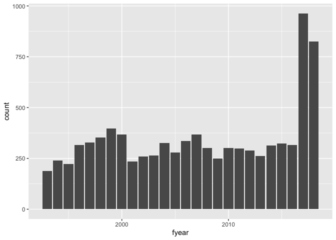
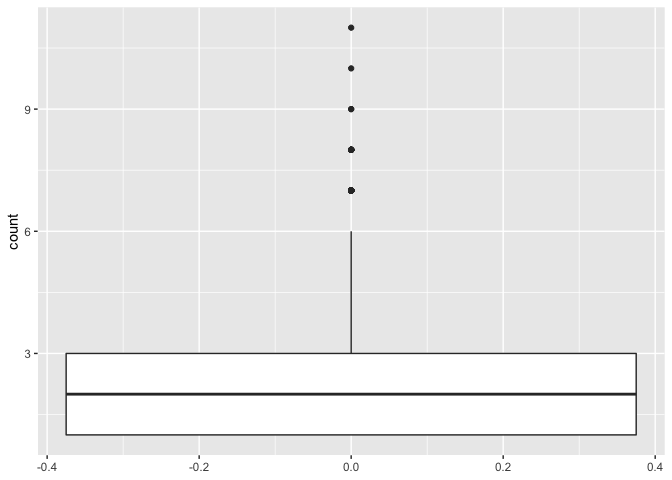
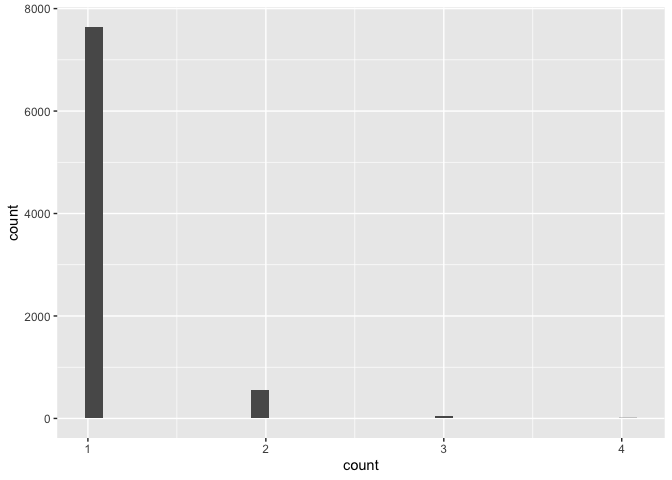
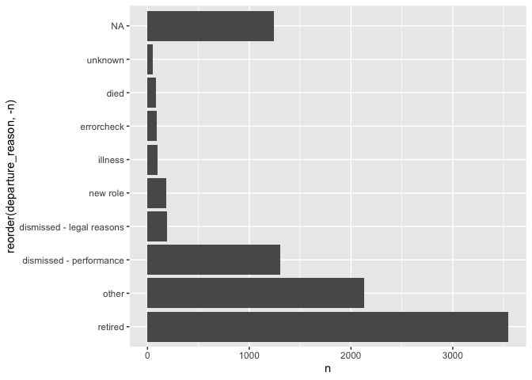

Tidy Tuesday 2021-18 CEO Departures
================

## Introduction

The \#TidyTuesday data this week comes from Gentry et al. (2021) by way
of DataIsPlural.

*We introduce an open‐source dataset documenting the reasons for CEO
departure in S&P 1500 firms from 2000 through 2018. In our dataset, we
code for various forms of voluntary and involuntary departure. We
compare our dataset to three published datasets in the CEO succession
literature to assess both the qualitative and quantitative differences
among them and to explore how these differences impact empirical
findings associated with the performance‐CEO dismissal relationship. The
dataset includes eight different classifications for CEO turnover, a
narrative description of each departure event, and links to sources used
in constructing the narrative so that future researchers can validate or
adapt the coding. The resulting data are available at
(<https://doi.org/10.5281/zenodo.4543893>).*

*This revision includes potentially relevant 8k filings from 270 days
before and after the CEO’s departure date. These filings were not all
useful for understanding the departure, but might be useful in general.*

I will also note that a United States fiscal year runs from 1 October to
30 September.

## Setup

``` r
library(tidytuesdayR)
library(tidyverse)
```

## Import Data

``` r
tuesdata <- tidytuesdayR::tt_load('2021-04-27')
```

    ## 
    ##  Downloading file 1 of 1: `departures.csv`

``` r
departures <- readr::read_csv('https://raw.githubusercontent.com/rfordatascience/tidytuesday/master/data/2021/2021-04-27/departures.csv')
```

## Tidy Data

Only one entry each in 1987 and in 2020; no entries in 1988 - 1991.
Considering as outliers, so excluding from dataset before analysis.

Also removing 1992 and 2019 data as potentially incomplete. Source
website indicates dataset covers 1992-2018.

``` r
departures_tidy <- departures %>%
  filter(!fyear %in% c(1987, 1988, 1989, 1990, 1991, 1992, 2019, 2020))
```

## Exploratory Data Analysis

### Question 1: How has the number of CEO departures per year changed over time?

``` r
departures_per_year <- departures_tidy %>%
  group_by(fyear) %>%
  summarise(count = n(), percent = round(count / 1500 * 100, digits = 1)) %>%
  arrange(desc(fyear))
departures_per_year
```

    ## # A tibble: 26 × 3
    ##    fyear count percent
    ##    <dbl> <int>   <dbl>
    ##  1  2018   826    55.1
    ##  2  2017   963    64.2
    ##  3  2016   317    21.1
    ##  4  2015   324    21.6
    ##  5  2014   313    20.9
    ##  6  2013   262    17.5
    ##  7  2012   288    19.2
    ##  8  2011   298    19.9
    ##  9  2010   300    20  
    ## 10  2009   250    16.7
    ## # … with 16 more rows

``` r
ggplot(departures_per_year, aes(x = fyear, y = count)) +
    geom_col()
```

<!-- -->

The number of CEO departures in each financial year did not vary a great
deal, until a sharp increase in the number of departures in financial
years 2017 and 2018.

### Question 2: Of the 1500 companies how many changed CEO in each fiscal year (from 2000 to 2018)?

``` r
top_departures_per_year <- departures_per_year %>%
  top_n(n = 1, wt = count)
```

So, the highest number of companies to change CEO in a financial year
was in 963 (64.2%) in 2017.

<!-- Could there be something to explore about timing vis-a-vis recessions? -->

### Question 3: How often are companies changing CEO ?

``` r
departures_by_company <- departures_tidy %>%
  group_by(coname) %>%
  summarise(count = n()) %>%
  arrange(desc(count)) 
summary(departures_by_company$count)
```

    ##    Min. 1st Qu.  Median    Mean 3rd Qu.    Max. 
    ##   1.000   1.000   2.000   2.359   3.000  11.000

``` r
ggplot(departures_by_company, aes(y = count)) +
  geom_boxplot()
```

<!-- -->

### Question 4: Which CEOs have departed multiple times and how many times?

``` r
departures_by_ceo <- departures_tidy %>%
  group_by(exec_fullname) %>%
  summarise(count = n()) %>%
  arrange(desc(count)) 
summary(departures_by_ceo$count)
```

    ##    Min. 1st Qu.  Median    Mean 3rd Qu.    Max. 
    ##   1.000   1.000   1.000   1.081   1.000   4.000

``` r
top_departures_by_ceo <- departures_by_ceo %>%
  top_n(n = 10, wt = count)
top_departures_by_ceo
```

    ## # A tibble: 53 × 2
    ##    exec_fullname              count
    ##    <chr>                      <int>
    ##  1 Constantine S. Macricostas     4
    ##  2 Edward D. Breen                4
    ##  3 John W. Rowe                   4
    ##  4 Mark Vincent Hurd              4
    ##  5 Mel Karmazin                   4
    ##  6 Albert L. Lord                 3
    ##  7 Amin J. Khoury                 3
    ##  8 Dale W. Hilpert                3
    ##  9 Daniel Francis Akerson         3
    ## 10 David Allen Brandon            3
    ## # … with 43 more rows

``` r
ggplot(departures_by_ceo, aes(x = count)) +
  geom_histogram(bins = 30)
```

<!-- -->

### Question 5: What reasons are companies giving for changing CEO ?

``` r
departures_by_reason <- departures_tidy %>%
  group_by(ceo_dismissal) %>%
  summarise(n = n()) %>%
  mutate(ceo_dismissal = case_when(
    ceo_dismissal == 0 ~ "not dismissed",
    ceo_dismissal == 1 ~ "dismissed",
                  TRUE ~ "not recorded"), 
    percent = round(n / sum(n) * 100, 1)
  )

departures_by_reason
```

    ## # A tibble: 3 × 3
    ##   ceo_dismissal     n percent
    ##   <chr>         <int>   <dbl>
    ## 1 not dismissed  6059    67.9
    ## 2 dismissed      1471    16.5
    ## 3 not recorded   1391    15.6

Of the 8253 CEO departures in the period, 1471 were because the CEO was
dismissed. How does this compare with the reasons for CEO departure
recorded in the data?

``` r
departures_by_code <- departures_tidy %>%
  group_by(departure_code) %>%
  summarise(n = n()) %>%
  mutate(
    departure_reason = case_when(
    departure_code == 1 ~ "died",
    departure_code == 2 ~ "illness",
    departure_code == 3 ~ "dismissed - performance",
    departure_code == 4 ~ "dismissed - legal reasons",
    departure_code == 5 ~ "retired",
    departure_code == 6 ~ "new role",
    departure_code == 7 ~ "other",
    departure_code == 8 ~ "unknown",
    departure_code == 9 ~ "errorcheck"
    ), percent = round(n / sum(n) * 100, 1)
  ) %>% 
  group_by(departure_reason) %>%
  arrange(desc(n))

departures_by_code
```

    ## # A tibble: 10 × 4
    ## # Groups:   departure_reason [10]
    ##    departure_code     n departure_reason          percent
    ##             <dbl> <int> <chr>                       <dbl>
    ##  1              5  3545 retired                      39.7
    ##  2              7  2127 other                        23.8
    ##  3              3  1302 dismissed - performance      14.6
    ##  4             NA  1245 <NA>                         14  
    ##  5              4   195 dismissed - legal reasons     2.2
    ##  6              6   182 new role                      2  
    ##  7              2    96 illness                       1.1
    ##  8              9    93 errorcheck                    1  
    ##  9              1    83 died                          0.9
    ## 10              8    53 unknown                       0.6

``` r
ggplot(departures_by_code, aes(x = reorder(departure_reason, -n), y = n)) +
    geom_col() +
    coord_flip()
```

<!-- -->

While 1471 departures are identified as being dismissals (above), there
are 1302 + 195 = 1497 with a departure reason that indicates the ceo was
dismissed.

``` r
departures_tidy %>%
  filter (departure_code %in% c(3, 4) & ceo_dismissal != 1)
```

    ## # A tibble: 26 × 19
    ##    dismissal_datase… coname  gvkey fyear co_per_rol exec_fullname departure_code
    ##                <dbl> <chr>   <dbl> <dbl>      <dbl> <chr>                  <dbl>
    ##  1               306 AUTOMA…  1891  2011        231 Gary C. Butl…              4
    ##  2              1553 GRACE …  5250  1994       1055 J. P. Bolduc               4
    ##  3              3440 TEXACO… 10482  2000       2167 Peter I. Bij…              4
    ##  4              1983 KEANE …  6362  2005      12566 Brian T. Kea…              4
    ##  5               492 BOEING…  2285  2004      14087 Harry C. Sto…              4
    ##  6              7382 MAXIMU… 64901  2006      18125 Lynn P. Dave…              4
    ##  7              7047 CARBO … 62686  2005      22857 C. Mark Pear…              4
    ##  8              3299 STRYKE… 10115  2011      26675 Stephen P. M…              4
    ##  9              4459 CBS CO… 13714  2018      29214 Leslie Moonv…              4
    ## 10               441 BEST B…  2184  2011      29475 Brian J. Dunn              4
    ## # … with 16 more rows, and 12 more variables: ceo_dismissal <dbl>,
    ## #   interim_coceo <chr>, tenure_no_ceodb <dbl>, max_tenure_ceodb <dbl>,
    ## #   fyear_gone <dbl>, leftofc <dttm>, still_there <chr>, notes <chr>,
    ## #   sources <chr>, eight_ks <chr>, cik <dbl>, _merge <chr>

These 26 entries should probably have their ceo\_dismissal value changed
to ‘0’ from ‘1.’ If this is done, then the total number of dismissals
matches with the number of departures with a dismissal reason (1471 + 26
= 1497). <!-- How to do this? dplyr's rows_update() is impenetrable. -->

``` r
top_departures_by_ceo %>%
  select(exec_fullname) %>%
  inner_join(departures_tidy, by = "exec_fullname") %>%
  select (exec_fullname, coname, fyear, departure_code, notes) %>%
  arrange(exec_fullname, desc(fyear))
```

    ## # A tibble: 164 × 5
    ##    exec_fullname              coname            fyear departure_code notes      
    ##    <chr>                      <chr>             <dbl>          <dbl> <chr>      
    ##  1 Albert L. Lord             SLM CORP           2013              5 "\"Sallie …
    ##  2 Albert L. Lord             NAVIENT CORP       2008              5 "Sallie Ma…
    ##  3 Albert L. Lord             NAVIENT CORP       2004              5 "Albert Lo…
    ##  4 Amin J. Khoury             KLX INC            2017              7 "On Octobe…
    ##  5 Amin J. Khoury             B/E AEROSPACE INC  2014              5 "WELLINGTO…
    ##  6 Amin J. Khoury             B/E AEROSPACE INC  1995              5 "Amin J. K…
    ##  7 Constantine S. Macricostas PHOTRONICS INC     2015              7 "Constanti…
    ##  8 Constantine S. Macricostas PHOTRONICS INC     2005              7 "Constanti…
    ##  9 Constantine S. Macricostas PHOTRONICS INC     2001              9 "Execucomp…
    ## 10 Constantine S. Macricostas PHOTRONICS INC     1997              5 "Constanti…
    ## # … with 154 more rows

### Question 6: What happened in 2017 and 2018?

``` r
departures_tidy %>%
  filter(fyear %in% c(2017, 2018))
```

    ## # A tibble: 1,789 × 19
    ##    dismissal_datase… coname  gvkey fyear co_per_rol exec_fullname departure_code
    ##                <dbl> <chr>   <dbl> <dbl>      <dbl> <chr>                  <dbl>
    ##  1               145 AMERIC…  1447  2017        111 Kenneth I. C…              5
    ##  2               854 COMCAS…  3226  2017        581 Brian L. Rob…             NA
    ##  3              1085 DILLAR…  3964  2017        754 William T. D…             NA
    ##  4              2081 L BRAN…  6733  2017       1329 Leslie H. We…             NA
    ##  5              2510 NIKE I…  7906  2018       1623 Mark G. Park…              5
    ##  6              2524 NACCO …  7938  2017       1638 Alfred Marsh…              5
    ##  7              3857 WORTHI… 11600  2018       2414 John P. McCo…              5
    ##  8               712 CENTUR…  2884  2017       2865 Glen F. Post…              5
    ##  9              1772 VECTRE…  5918  2017       3320 Carl L. Chap…              7
    ## 10              2043 LANCAS…  6573  2017       3396 John B. Gerl…              5
    ## # … with 1,779 more rows, and 12 more variables: ceo_dismissal <dbl>,
    ## #   interim_coceo <chr>, tenure_no_ceodb <dbl>, max_tenure_ceodb <dbl>,
    ## #   fyear_gone <dbl>, leftofc <dttm>, still_there <chr>, notes <chr>,
    ## #   sources <chr>, eight_ks <chr>, cik <dbl>, _merge <chr>

<!-- Could do a search through notes field for misconduct reasons -->

## Clean up

``` r
rm(departures)
rm(tuesdata)
rm(departures_per_year)
```

# References or Bibliography

<div id="refs" class="references csl-bib-body hanging-indent">

<div id="ref-data" class="csl-entry">

Gentry, Richard J., Joseph S. Harrison, Timothy J. Quigley, and Steven
Boivie. 2021. “A Database of CEO Turnover and Dismissal in s&p 1500
Firms, 2000–2018.” *Strategic Management Journal* 42 (5): 968–91.
https://doi.org/<https://doi.org/10.1002/smj.3278>.

</div>

<div id="ref-tidytuesday" class="csl-entry">

Mock, Thomas. 2021. “Tidy Tuesday: A Weekly Data Project Aimed at the r
Ecosystem.” <https://github.com/rfordatascience/tidytuesday>.

</div>

<div id="ref-R-base" class="csl-entry">

R Core Team. 2019. *R: A Language and Environment for Statistical
Computing*. Vienna, Austria: R Foundation for Statistical Computing.
<https://www.R-project.org>.

</div>

</div>
