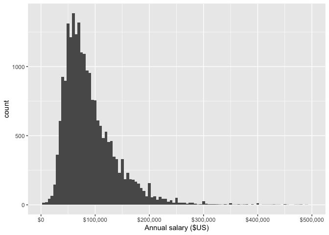
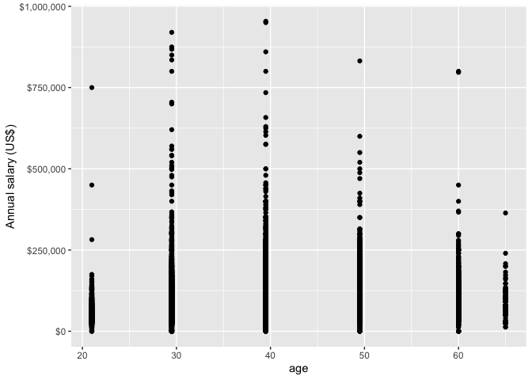
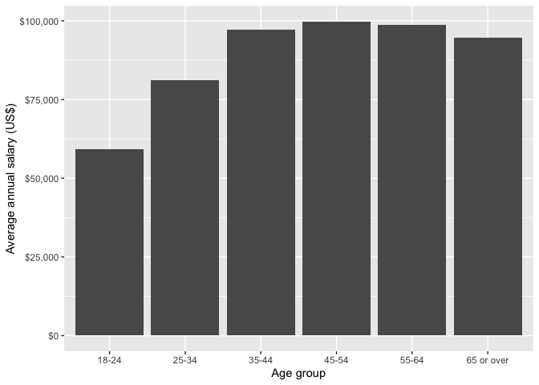

Tidy Tuesday 2021-21 Ask a manager survey
================

## Introduction

My first serious attempt at using R to clean real data.

## Setup

``` r
library(tidytuesdayR)
library(tidyverse)
library(countrycode)
library(scales)
```

<!-- ## Import data - first time -->
<!-- ```{r get_the_data, cache = TRUE, message = FALSE} -->
<!-- survey <- read_csv('https://raw.githubusercontent.com/rfordatascience/tidytuesday/master/data/2021/2021-05-18/survey.csv') -->
<!-- write_csv(survey, 'data/survey.csv') -->
<!-- rm tuesdata -->
<!-- ``` -->

## Import data - subsequent times

``` r
survey <- read_csv('data/survey.csv')
survey_clean <- survey
glimpse(survey)
```

    ## Rows: 26,232
    ## Columns: 18
    ## $ timestamp                                <chr> "4/27/2021 11:02:10", "4/27/2…
    ## $ how_old_are_you                          <chr> "25-34", "25-34", "25-34", "2…
    ## $ industry                                 <chr> "Education (Higher Education)…
    ## $ job_title                                <chr> "Research and Instruction Lib…
    ## $ additional_context_on_job_title          <chr> NA, NA, NA, NA, NA, NA, NA, "…
    ## $ annual_salary                            <dbl> 55000, 54600, 34000, 62000, 6…
    ## $ other_monetary_comp                      <chr> "0", "4000", NA, "3000", "700…
    ## $ currency                                 <chr> "USD", "GBP", "USD", "USD", "…
    ## $ currency_other                           <chr> NA, NA, NA, NA, NA, NA, NA, N…
    ## $ additional_context_on_income             <chr> NA, NA, NA, NA, NA, NA, NA, N…
    ## $ country                                  <chr> "United States", "United King…
    ## $ state                                    <chr> "Massachusetts", NA, "Tenness…
    ## $ city                                     <chr> "Boston", "Cambridge", "Chatt…
    ## $ overall_years_of_professional_experience <chr> "5-7 years", "8 - 10 years", …
    ## $ years_of_experience_in_field             <chr> "5-7 years", "5-7 years", "2 …
    ## $ highest_level_of_education_completed     <chr> "Master's degree", "College d…
    ## $ gender                                   <chr> "Woman", "Non-binary", "Woman…
    ## $ race                                     <chr> "White", "White", "White", "W…

## Data cleaning - this may take some time …

### Gender

Let’s start by looking at the gender variable in our dataset.

``` r
survey %>% 
  count(gender, sort = TRUE)
```

    ## # A tibble: 6 x 2
    ##   gender                            n
    ##   <chr>                         <int>
    ## 1 Woman                         20359
    ## 2 Man                            4743
    ## 3 Non-binary                      713
    ## 4 Other or prefer not to answer   268
    ## 5 <NA>                            148
    ## 6 Prefer not to answer              1

While this looks pretty clean, there are two immediate issues. First,
there is a single “prefer not to answer” observation even though there
are numerous observations described as “Other or prefer not to answer.”
Since there is no way to distinguish between survey respondents who are
identifying with an “other” gender not listed and those that “prefer not
to answer,” this group of observations cannot be separated. To simplify,
let’s roll the single “prefer not to answer” observation into this
broader group. Second, these observations currently use the character
data type, and it would be helpful for future analyses to have gender as
a categorical variable. Once tidied up, added a percentage column in
case of future plots.

``` r
# Clean the gender data, by collapsing one category into another.
survey_clean <- survey %>%
  mutate(gender_clean = fct_collapse(gender, "Other or prefer not to answer" = "Prefer not to answer")) %>%
# Clean up the temporary columns so variable name is 'gender' and set data type to categorical.
  select(-gender) %>%
  mutate(gender = as.factor(gender_clean)) %>%
  select(-gender_clean)
  
# Calculate the percentages of each category, sort the data and plot it.
survey_clean %>%
  count(gender) %>%
  mutate (percent = round(n / sum(n) * 100, 1)) %>%
  arrange(desc(percent)) %>%
  ggplot(aes(x = reorder(gender, -percent), y = percent)) + geom_col()
```

<!-- -->

#### Questions

1.  I had a go at using stringr to clean this as strings, but it was
    pretty painful. This forcats package solution seemed easier and
    probably better suited to the categorical data that I was trying to
    wrangle. Are there positives/negatives to either approach ?
2.  Is there merit in collapsing the “Other or prefer not to answer”
    group of observations into “NA.” If so, how ..? I got stuck trying
    to mutate the same column multiple times and R wasn’t happy.

### Country

Let’s look at country now.

``` r
survey %>% 
  count(country, sort = TRUE)
```

    ## # A tibble: 294 x 2
    ##    country                      n
    ##    <chr>                    <int>
    ##  1 United States             9010
    ##  2 USA                       7918
    ##  3 US                        2485
    ##  4 Canada                    1543
    ##  5 United Kingdom             584
    ##  6 UK                         579
    ##  7 U.S.                       569
    ##  8 United States of America   425
    ##  9 Usa                        420
    ## 10 Australia                  368
    ## # … with 284 more rows

What a mess. Let’s have a go at tidying some of these up …

``` r
survey_clean <- survey_clean %>%
  mutate(country = str_to_lower(country)) %>%
  mutate(country = case_when(
    str_detect(country, "england") ~ "united kingdom",
    str_detect(country, "scotland") ~ "united kingdom",
    str_detect(country, "wales") ~ "united kingdom",
    str_detect(country, "northern ireland") ~ "united kingdom",
    country %in% c("englang", "united kindom", "unites kingdom", "u.k.", "gb") ~ "united kingdom",
    country %in% c("can", "canda", "csnada", "canad") ~ "canada",
    country == "danmark" ~ "denmark",
    country == "australi" ~ "australia",
    country == "nz" ~ "new zealand",
    country == "brasil" ~ "brazil",
    country %in% c("nl", "nederland") ~ "netherlands",
    country %in% c("untied states", "united state", "united stated", "united sates", "unites states", "united statws", "united state of america", "united statew", "united stares", "unitef stated", "uniyed states", "unted states", "usaa", "california", "united stateds", "unite states") ~ "united states",
    TRUE ~ country
    ), country_code = countrycode(country, origin = 'country.name', destination = 'iso3c'))
```

    ## Warning in countrycode(country, origin = "country.name", destination = "iso3c"): Some values were not matched unambiguously: 🇺🇸, $2,175.84/year is deducted for benefits, africa, america, argentina but my org is in thailand, bonus based on meeting yearly goals set w/ my supervisor, canada and usa, canadw, catalonia, contracts, currently finance, europe, global, hartford, i earn commission on sales. if i meet quota, i'm guaranteed another 16k min. last year i earned an additional 27k. it's not uncommon for people in my space to earn 100k+ after commission., i was brought in on this salary to help with the ehr and very quickly was promoted to current position but compensation was not altered., i work for a uae-based organization, though i am personally in the us., i.s., international, is, isa, méxico, n/a (remote from wherever i want), panamá, remote, san francisco, the us, u. s, u. s., u.a., ua, uk for u.s. company, uk, but for globally fully remote company, uk, remote, uniited states, united  states, united sates of america, united statea, united statees, united states (i work from home and my clients are all over the us/canada/pr, united states- puerto rico, united statesp, united statss, united stattes, united statues, united status, united sttes, united y, uniteed states, uniter statez, unitied states, uniyes states, usa-- virgin islands, usab, usat, usd, uss, uxz, virginia, we don't get raises, we get quarterly bonuses, but they periodically asses income in the area you work, so i got a raise because a 3rd party assessment showed i was paid too little for the area we were located, worldwide (based in us but short term trips aroudn the world), y

    ## Warning in countrycode(country, origin = "country.name", destination = "iso3c"): Some strings were matched more than once, and therefore set to <NA> in the result: argentina but my org is in thailand,ARG,THA; canada and usa,CAN,USA; united states (i work from home and my clients are all over the us/canada/pr,CAN,USA; united states- puerto rico,PRI,USA; usa-- virgin islands,VIR,USA

``` r
survey_clean %>%
  mutate(country_name = countrycode(country_code, origin = 'iso3c', destination = 'country.name')) %>%
  group_by(country_name) %>%
  summarise(count = n()) %>%
  top_n(n = 10, wt = count) %>%
  ggplot(aes(x = reorder(country_name, count), y = count)) + geom_col() + coord_flip()
```

<!-- -->
\#\# Finance data

``` r
# Read in a list of exchange rates. In future I would want this to be dynamically generated, using an API like fixerapi, but for now, I'd like the exchange rates to stay the same, so it I can more easily see errors I'm creating.
rates <- read_csv("data/exchange.csv")
```

    ## 
    ## ── Column specification ────────────────────────────────────────────────────────
    ## cols(
    ##   date = col_character(),
    ##   source = col_character(),
    ##   destination = col_character(),
    ##   rate = col_double()
    ## )

``` r
survey_clean %>%
  select(annual_salary, currency, currency_other) %>%
  filter(currency != "USD" & is.na(currency) == FALSE) %>%
  count(currency, sort = TRUE)
```

    ## # A tibble: 10 x 2
    ##    currency     n
    ##    <chr>    <int>
    ##  1 CAD       1564
    ##  2 GBP       1521
    ##  3 EUR        585
    ##  4 AUD/NZD    469
    ##  5 Other      133
    ##  6 CHF         35
    ##  7 SEK         34
    ##  8 JPY         22
    ##  9 ZAR         13
    ## 10 HKD          4

``` r
  # Returns non-USD entries

survey_clean %>%
  select(annual_salary, currency, currency_other) %>%
  filter(currency == "Other" & is.na(currency_other) == FALSE)
```

    ## # A tibble: 129 x 3
    ##    annual_salary currency currency_other
    ##            <dbl> <chr>    <chr>         
    ##  1        885000 Other    INR           
    ##  2       1080000 Other    Peso Argentino
    ##  3         80640 Other    MYR           
    ##  4         60000 Other    CHF           
    ##  5        800000 Other    NOK           
    ##  6        669500 Other    NOK           
    ##  7         48068 Other    USD           
    ##  8        156000 Other    BR$           
    ##  9        318000 Other    SEK           
    ## 10       1400000 Other    Dkk           
    ## # … with 119 more rows

``` r
  # Returns entries where the currency was "Other", so hopefully there's something in the "Other" field to mutate across.

survey_clean %>%
  select(annual_salary, currency, currency_other) %>%
  filter(currency == "USD" & is.na(currency_other) == FALSE)
```

    ## # A tibble: 25 x 3
    ##    annual_salary currency currency_other                                        
    ##            <dbl> <chr>    <chr>                                                 
    ##  1         76302 USD      $76,302.34                                            
    ##  2         64000 USD      My bonus is based on performance up to 10% of salary  
    ##  3         53000 USD      I work for an online state university, managing admis…
    ##  4         53500 USD      0                                                     
    ##  5        120000 USD      N/A                                                   
    ##  6         13560 USD      KWD                                                   
    ##  7         50000 USD      Na                                                    
    ##  8        100000 USD      N/A                                                   
    ##  9         33000 USD      Base plus Commission                                  
    ## 10     102000000 USD      COP                                                   
    ## # … with 15 more rows

``` r
  # Returns USD entries where there was also something in the "Other" field.

survey_clean %>%
  select(annual_salary, currency, currency_other) %>%
  inner_join(rates, by = c("currency" = "source")) %>%
  filter(currency == "USD" & is.na(currency_other) == TRUE & annual_salary != 0) %>%
  mutate(usd_salary = annual_salary * rate) %>%
  select(usd_salary) %>%
  arrange(desc(usd_salary)) %>%
  ggplot(aes(usd_salary)) + geom_histogram(binwidth = 5000) + scale_x_continuous("Annual salary ($US)", label = label_dollar(), limits = c(1000, 500000))
```

    ## Warning: Removed 90 rows containing non-finite values (stat_bin).

    ## Warning: Removed 2 rows containing missing values (geom_bar).

<!-- -->

``` r
# Where did the 2 missing values come from, given filtering for NA above?
# What are the 90 rows with 'non-finite values'? 
```

## Going to try something crazy … fitting a linear model to the annual salary calculations, using age (initially)

``` r
input <- survey_clean %>%
  select(how_old_are_you, annual_salary, currency, currency_other) %>%
  inner_join(rates, by = c("currency" = "source")) %>%
  filter(is.na(currency_other) == TRUE & annual_salary != 0 & how_old_are_you != "under 18") %>%
  mutate(usd_salary = annual_salary * rate) %>%
  filter(usd_salary < 1000000) %>%
  mutate(age = case_when(
    how_old_are_you == "18-24" ~ 21,
    how_old_are_you == "25-34" ~ 29.5,
    how_old_are_you == "35-44" ~ 39.5,
    how_old_are_you == "45-54" ~ 49.5,
    how_old_are_you == "55-64" ~ 60,
    how_old_are_you == "65 or over" ~ 65,
    )
  ) %>%
  mutate(age2 = age * age) %>%
  select(age, age2, usd_salary) %>%
  arrange(desc(usd_salary))

model_plot <- ggplot(data = input, aes(x = age, y = usd_salary)) + geom_point() + scale_y_continuous("Annual salary (US$)", label = label_dollar())

model <- lm(usd_salary ~ age + age2, data = input)

model_plot + geom_smooth(method = "lm", formula = y ~ poly(x, 2))
```

<!-- -->

``` r
model_plot
```

<!-- -->

``` r
survey_clean %>%
  select(how_old_are_you, annual_salary, currency, currency_other) %>%
  inner_join(rates, by = c("currency" = "source")) %>%
  filter(is.na(currency_other) == TRUE & annual_salary != 0 & how_old_are_you != "under 18") %>%
  mutate(usd_salary = annual_salary * rate) %>%
  group_by(how_old_are_you) %>%
  summarize(avg_salary = mean(usd_salary)) %>%
  ggplot(aes(x = how_old_are_you, y = avg_salary)) + geom_col() + scale_y_continuous("Average annual salary (US$)", label = label_dollar()) + scale_x_discrete("Age group")
```

<!-- -->

## References

<div id="refs" class="references csl-bib-body hanging-indent">

<div id="ref-tidytuesday" class="csl-entry">

Mock, Thomas. 2021. “Tidy Tuesday: A Weekly Data Project Aimed at the r
Ecosystem.” <https://github.com/rfordatascience/tidytuesday>.

</div>

<div id="ref-R-base" class="csl-entry">

R Core Team. 2019. *R: A Language and Environment for Statistical
Computing*. Vienna, Austria: R Foundation for Statistical Computing.
<https://www.R-project.org>.

</div>

</div>
