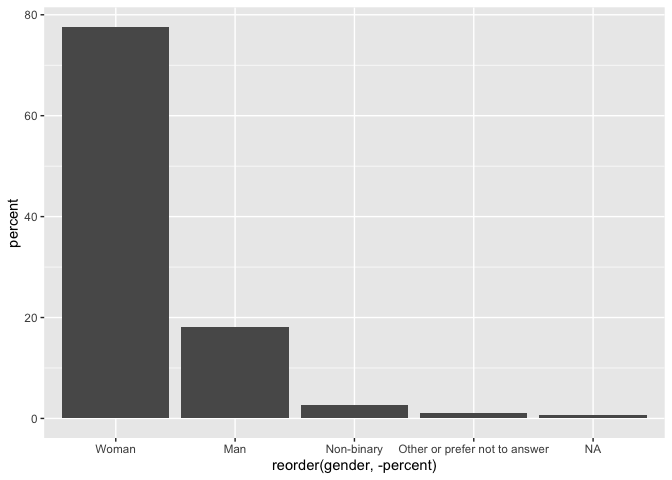
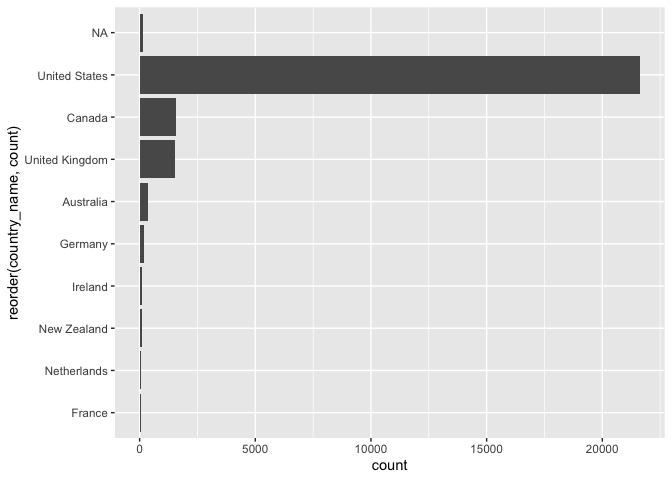

Tidy Tuesday 2021-21 Ask a manager survey
================

## Introduction

My first serious attempt at using R to clean real data.

## Setup

``` r
library(tidytuesdayR)
library(tidyverse)
library(countrycode)
```

<!-- ## Import data - first time -->
<!-- ```{r get_the_data, cache = TRUE, message = FALSE} -->
<!-- survey <- read_csv('https://raw.githubusercontent.com/rfordatascience/tidytuesday/master/data/2021/2021-05-18/survey.csv') -->
<!-- write_csv(survey, 'data/survey.csv') -->
<!-- rm tuesdata -->
<!-- ``` -->

## Import data - subsequent times

``` r
survey <- read_csv('data/survey.csv')
survey_clean <- survey
glimpse(survey)
```

    ## Rows: 26,232
    ## Columns: 18
    ## $ timestamp                                <chr> "4/27/2021 11:02:10", "4/27/2…
    ## $ how_old_are_you                          <chr> "25-34", "25-34", "25-34", "2…
    ## $ industry                                 <chr> "Education (Higher Education)…
    ## $ job_title                                <chr> "Research and Instruction Lib…
    ## $ additional_context_on_job_title          <chr> NA, NA, NA, NA, NA, NA, NA, "…
    ## $ annual_salary                            <dbl> 55000, 54600, 34000, 62000, 6…
    ## $ other_monetary_comp                      <chr> "0", "4000", NA, "3000", "700…
    ## $ currency                                 <chr> "USD", "GBP", "USD", "USD", "…
    ## $ currency_other                           <chr> NA, NA, NA, NA, NA, NA, NA, N…
    ## $ additional_context_on_income             <chr> NA, NA, NA, NA, NA, NA, NA, N…
    ## $ country                                  <chr> "United States", "United King…
    ## $ state                                    <chr> "Massachusetts", NA, "Tenness…
    ## $ city                                     <chr> "Boston", "Cambridge", "Chatt…
    ## $ overall_years_of_professional_experience <chr> "5-7 years", "8 - 10 years", …
    ## $ years_of_experience_in_field             <chr> "5-7 years", "5-7 years", "2 …
    ## $ highest_level_of_education_completed     <chr> "Master's degree", "College d…
    ## $ gender                                   <chr> "Woman", "Non-binary", "Woman…
    ## $ race                                     <chr> "White", "White", "White", "W…

## Data cleaning - this may take some time …

### Gender

Let’s start by looking at the gender variable in our dataset.

``` r
survey %>% 
  count(gender)
```

    ## # A tibble: 6 x 2
    ##   gender                            n
    ##   <chr>                         <int>
    ## 1 Man                            4743
    ## 2 Non-binary                      713
    ## 3 Other or prefer not to answer   268
    ## 4 Prefer not to answer              1
    ## 5 Woman                         20359
    ## 6 <NA>                            148

While this looks pretty clean, there are two immediate issues. First,
there is a single “prefer not to answer” observation even though there
are numerous observations described as “Other or prefer not to answer.”
Since there is no way to distinguish between survey respondents who are
identifying with an “other” gender not listed and those that “prefer not
to answer,” this group of observations cannot be separated. To simplify,
let’s roll the single “prefer not to answer” observation into this
broader group. Second, these observations currently use the character
data type, and it would be helpful for future analyses to have gender as
a categorical variable. Once tidied up, added a percentage column in
case of future plots.

``` r
# Clean the gender data, by collapsing one category into another.
survey_clean <- survey %>%
  mutate(gender_clean = fct_collapse(gender, "Other or prefer not to answer" = "Prefer not to answer")) %>%
# Clean up the temporary columns so variable name is 'gender' and set data type to categorical.
  select(-gender) %>%
  mutate(gender = as.factor(gender_clean)) %>%
  select(-gender_clean)
  
# Calculate the percentages of each category, sort the data and plot it.
survey_clean %>%
  count(gender) %>%
  mutate (percent = round(n / sum(n) * 100, 1)) %>%
  arrange(desc(percent)) %>%
  ggplot(aes(x = reorder(gender, -percent), y = percent)) + geom_col()
```

<!-- -->

#### Questions

1.  I had a go at using stringr to clean this as strings, but it was
    pretty painful. This forcats package solution seemed easier and
    probably better suited to the categorical data that I was trying to
    wrangle. Are there positives/negatives to either approach ?
2.  Is there merit in collapsing the “Other or prefer not to answer”
    group of observations into “NA.” If so, how ..? I got stuck trying
    to mutate the same column multiple times and R wasn’t happy.

### Country

Let’s look at country now.

``` r
survey %>% 
  count(country) %>%
  arrange(desc(n))
```

    ## # A tibble: 294 x 2
    ##    country                      n
    ##    <chr>                    <int>
    ##  1 United States             9010
    ##  2 USA                       7918
    ##  3 US                        2485
    ##  4 Canada                    1543
    ##  5 United Kingdom             584
    ##  6 UK                         579
    ##  7 U.S.                       569
    ##  8 United States of America   425
    ##  9 Usa                        420
    ## 10 Australia                  368
    ## # … with 284 more rows

What a mess. Let’s have a go at tidying some of these up …

``` r
survey$country <- survey$country %>%
  str_remove_all("'.'") %>% # remove full stops
  str_to_lower()        # remove capitalisation inconsistencies

survey_clean <- survey %>%
  # select(country, state, city) %>% # Testing only, shows a bit more context for cleaning ...
  mutate(country = case_when(
    country %in% c("england", "englang", "scotland", "wales", "northern ireland", "united kindom", "unites kingdom", "uk", "u.k.") ~ "united kingdom",
    country %in% c("can", "canda", "csnada", "canad") ~ "canada",
    country == "danmark" ~ "denmark",
    country == "nl" ~ "netherlands",
    country %in% c("untied states", "united state", "united stated", "united sates", "unites states", "united statws", "united state of america") ~ "united states", # There must be a regular expression solution to this mess
    TRUE ~ country
    ), country_code = countrycode(country, origin = 'country.name', destination = 'iso3c')) # %>%
```

    ## Warning in countrycode(country, origin = "country.name", destination = "iso3c"): Some values were not matched unambiguously: 🇺🇸, $2,175.84/year is deducted for benefits, africa, america, argentina but my org is in thailand, australi, bonus based on meeting yearly goals set w/ my supervisor, brasil, california, canada and usa, canadw, catalonia, contracts, currently finance, england, gb, england, uk, england, uk., england/uk, europe, global, hartford, i earn commission on sales. if i meet quota, i'm guaranteed another 16k min. last year i earned an additional 27k. it's not uncommon for people in my space to earn 100k+ after commission., i was brought in on this salary to help with the ehr and very quickly was promoted to current position but compensation was not altered., i work for a uae-based organization, though i am personally in the us., i.s., international, is, isa, méxico, n/a (remote from wherever i want), nederland, nz, panamá, remote, san francisco, scotland, uk, the us, u. s, u. s., u.a., u.k. (northern england), ua, uk (england), uk (northern ireland), uk for u.s. company, uk, but for globally fully remote company, uk, remote, uniited states, unite states, united  states, united sates of america, united stares, united statea, united stateds, united statees, united states (i work from home and my clients are all over the us/canada/pr, united states- puerto rico, united statesp, united statew, united statss, united stattes, united statues, united status, united sttes, united y, uniteed states, unitef stated, uniter statez, unitied states, uniyed states, uniyes states, unted states, usa-- virgin islands, usaa, usab, usat, usd, uss, uxz, virginia, wales (uk), wales, uk, we don't get raises, we get quarterly bonuses, but they periodically asses income in the area you work, so i got a raise because a 3rd party assessment showed i was paid too little for the area we were located, worldwide (based in us but short term trips aroudn the world), y

    ## Warning in countrycode(country, origin = "country.name", destination = "iso3c"): Some strings were matched more than once, and therefore set to <NA> in the result: argentina but my org is in thailand,ARG,THA; canada and usa,CAN,USA; united states (i work from home and my clients are all over the us/canada/pr,CAN,USA; united states- puerto rico,PRI,USA; usa-- virgin islands,VIR,USA

``` r
 # filter(is.na(country_code) == TRUE) # Testing only, shows how far to go to clean this data ...
```

#### Questions:

1.  Is there a good regular expression approach to cleaning these data,
    especially all the variations on US, United States, Untied Status
    (sic) etc. ?
2.  Is there a good approach to whittling down the remaining entries
    (eg. those with “uk” in them) ? Or is this diminishing returns in a
    dataset of this scale and distribution ? My thinking was that Canada
    and the UK are pretty close in number of observations, so it might
    be worth pressing on.
3.  At what point should I switch to manually editing the data, instead
    of using R, and keep track of the changes to the CSV file through
    version control software (like git) ?

``` r
survey_clean %>%
  mutate(country_name = countrycode(country_code, origin = 'iso3c', destination = 'country.name')) %>%
  group_by(country_name) %>%
  summarise(count = n()) %>%
  top_n(n = 10, wt = count) %>%
  ggplot(aes(x = reorder(country_name, count), y = count)) + geom_col() + coord_flip()
```

<!-- -->

## References

<div id="refs" class="references csl-bib-body hanging-indent">

<div id="ref-tidytuesday" class="csl-entry">

Mock, Thomas. 2021. “Tidy Tuesday: A Weekly Data Project Aimed at the r
Ecosystem.” <https://github.com/rfordatascience/tidytuesday>.

</div>

<div id="ref-R-base" class="csl-entry">

R Core Team. 2019. *R: A Language and Environment for Statistical
Computing*. Vienna, Austria: R Foundation for Statistical Computing.
<https://www.R-project.org>.

</div>

</div>
