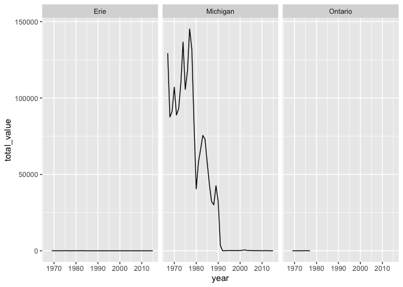
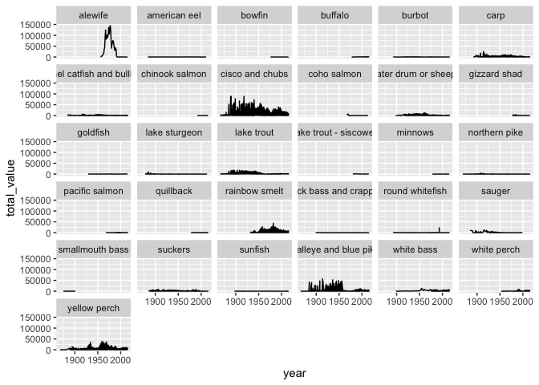

Tidy Tuesday: 2021-24 Commercial Fishing
================

<http://www.glfc.org/fishstocking/images/dbstruct.gif>

``` r
library(tidyverse)
```

    ## ── Attaching packages ─────────────────────────────────────── tidyverse 1.3.1 ──

    ## ✓ ggplot2 3.3.3     ✓ purrr   0.3.4
    ## ✓ tibble  3.1.1     ✓ dplyr   1.0.6
    ## ✓ tidyr   1.1.3     ✓ stringr 1.4.0
    ## ✓ readr   1.4.0     ✓ forcats 0.5.1

    ## ── Conflicts ────────────────────────────────────────── tidyverse_conflicts() ──
    ## x dplyr::filter() masks stats::filter()
    ## x dplyr::lag()    masks stats::lag()

``` r
library(lubridate)
```

    ## 
    ## Attaching package: 'lubridate'

    ## The following objects are masked from 'package:base':
    ## 
    ##     date, intersect, setdiff, union

``` r
fishing_raw <- readr::read_csv('https://raw.githubusercontent.com/rfordatascience/tidytuesday/master/data/2021/2021-06-08/fishing.csv')
```

    ## 
    ## ── Column specification ────────────────────────────────────────────────────────
    ## cols(
    ##   year = col_double(),
    ##   lake = col_character(),
    ##   species = col_character(),
    ##   grand_total = col_double(),
    ##   comments = col_character(),
    ##   region = col_character(),
    ##   values = col_double()
    ## )

``` r
stocked_raw <- readr::read_csv('https://raw.githubusercontent.com/rfordatascience/tidytuesday/master/data/2021/2021-06-08/stocked.csv')
```

    ## 
    ## ── Column specification ────────────────────────────────────────────────────────
    ## cols(
    ##   .default = col_character(),
    ##   SID = col_double(),
    ##   YEAR = col_double(),
    ##   MONTH = col_double(),
    ##   DAY = col_double(),
    ##   LATITUDE = col_logical(),
    ##   LONGITUDE = col_logical(),
    ##   GRID = col_double(),
    ##   NO_STOCKED = col_double(),
    ##   YEAR_CLASS = col_double(),
    ##   AGEMONTH = col_double(),
    ##   MARK_EFF = col_double(),
    ##   TAG_NO = col_logical(),
    ##   TAG_RET = col_double(),
    ##   LENGTH = col_double(),
    ##   WEIGHT = col_double(),
    ##   CONDITION = col_double(),
    ##   VALIDATION = col_double()
    ## )
    ## ℹ Use `spec()` for the full column specifications.

    ## Warning: 36320 parsing failures.
    ##  row    col           expected actual                                                                                                    file
    ## 4367 TAG_NO 1/0/T/F/TRUE/FALSE 604101 'https://raw.githubusercontent.com/rfordatascience/tidytuesday/master/data/2021/2021-06-08/stocked.csv'
    ## 4368 TAG_NO 1/0/T/F/TRUE/FALSE 604101 'https://raw.githubusercontent.com/rfordatascience/tidytuesday/master/data/2021/2021-06-08/stocked.csv'
    ## 4369 TAG_NO 1/0/T/F/TRUE/FALSE 604101 'https://raw.githubusercontent.com/rfordatascience/tidytuesday/master/data/2021/2021-06-08/stocked.csv'
    ## 4370 TAG_NO 1/0/T/F/TRUE/FALSE 604103 'https://raw.githubusercontent.com/rfordatascience/tidytuesday/master/data/2021/2021-06-08/stocked.csv'
    ## 4371 TAG_NO 1/0/T/F/TRUE/FALSE 604102 'https://raw.githubusercontent.com/rfordatascience/tidytuesday/master/data/2021/2021-06-08/stocked.csv'
    ## .... ...... .................. ...... .......................................................................................................
    ## See problems(...) for more details.

Appear to have lost 36320 rows in importing the stock data. Still have
56232 rows. Though 39% loss seems like a lot.

On a quick inspection using problems() …

``` r
problems(stocked_raw)
```

    ## # A tibble: 36,320 x 5
    ##      row col    expected      actual file                                       
    ##    <int> <chr>  <chr>         <chr>  <chr>                                      
    ##  1  4367 TAG_NO 1/0/T/F/TRUE… 604101 'https://raw.githubusercontent.com/rfordat…
    ##  2  4368 TAG_NO 1/0/T/F/TRUE… 604101 'https://raw.githubusercontent.com/rfordat…
    ##  3  4369 TAG_NO 1/0/T/F/TRUE… 604101 'https://raw.githubusercontent.com/rfordat…
    ##  4  4370 TAG_NO 1/0/T/F/TRUE… 604103 'https://raw.githubusercontent.com/rfordat…
    ##  5  4371 TAG_NO 1/0/T/F/TRUE… 604102 'https://raw.githubusercontent.com/rfordat…
    ##  6  4372 TAG_NO 1/0/T/F/TRUE… 604102 'https://raw.githubusercontent.com/rfordat…
    ##  7  4373 TAG_NO 1/0/T/F/TRUE… 604102 'https://raw.githubusercontent.com/rfordat…
    ##  8  4374 TAG_NO 1/0/T/F/TRUE… 604105 'https://raw.githubusercontent.com/rfordat…
    ##  9  4375 TAG_NO 1/0/T/F/TRUE… 604101 'https://raw.githubusercontent.com/rfordat…
    ## 10  4376 TAG_NO 1/0/T/F/TRUE… 604104 'https://raw.githubusercontent.com/rfordat…
    ## # … with 36,310 more rows

… it looks like: \* the tag\_no variable is being loaded as a logical
variable, when it should be a number or a series of numbers …

``` r
stocked_raw <- readr::read_csv('https://raw.githubusercontent.com/rfordatascience/tidytuesday/master/data/2021/2021-06-08/stocked.csv', col_types = "ddddffccdddccccddcdccccdcdcccdc")
```

No problems ! Here’s a list of the column types … SID, d YEAR, d MONTH,
d DAY, d LAKE, f STATE\_PROV, f SITE, c ST\_SITE, c LATITUDE, d
LONGITUDE, d GRID, d STAT\_DIST, c LS\_MGMT, c SPECIES, c STRAIN, c
NO\_STOCKED, d YEAR\_CLASS, d STAGE, c AGEMONTH, d MARK, c MARK\_EFF, c
TAG\_NO, c TAG\_RET, d to c LENGTH, d WEIGHT, d to c CONDITION, d
LOT\_CODE, c STOCK\_METH, c AGENCY, c VALIDATION, d NOTES, c

## Create a date field (where possible)

``` r
stocked_raw %>%
  mutate(DATE = make_date(YEAR, MONTH, DAY))
```

    ## # A tibble: 56,232 x 32
    ##      SID  YEAR MONTH   DAY LAKE  STATE_PROV SITE     ST_SITE  LATITUDE LONGITUDE
    ##    <dbl> <dbl> <dbl> <dbl> <fct> <fct>      <chr>    <chr>       <dbl>     <dbl>
    ##  1     1  1950    NA    NA MI    ON         PIE ISL… PIE            NA        NA
    ##  2     2  1952     4    29 SU    WI         APOSTLE… APOSTLE        NA        NA
    ##  3     3  1952     9    23 SU    WI         APOSTLE… APOSTLE        NA        NA
    ##  4     4  1952    NA    NA SU    MI         LAUGHIN… LAUGHIN…       NA        NA
    ##  5     5  1953     5    27 SU    WI         APOSTLE… APOSTLE        NA        NA
    ##  6     6  1953    10    10 SU    WI         APOSTLE… APOSTLE        NA        NA
    ##  7     7  1953    NA    NA SU    MI         LAUGHIN… LAUGHIN…       NA        NA
    ##  8     8  1953    NA    NA SU    MI         MARQUET… MARQUET…       NA        NA
    ##  9     9  1953    NA    NA SU    ON         PIE ISL… PIE            NA        NA
    ## 10    10  1954     6     8 SU    WI         APOSTLE… APOSTLE        NA        NA
    ## # … with 56,222 more rows, and 22 more variables: GRID <dbl>, STAT_DIST <chr>,
    ## #   LS_MGMT <chr>, SPECIES <chr>, STRAIN <chr>, NO_STOCKED <dbl>,
    ## #   YEAR_CLASS <dbl>, STAGE <chr>, AGEMONTH <dbl>, MARK <chr>, MARK_EFF <chr>,
    ## #   TAG_NO <chr>, TAG_RET <chr>, LENGTH <dbl>, WEIGHT <chr>, CONDITION <dbl>,
    ## #   LOT_CODE <chr>, STOCK_METH <chr>, AGENCY <chr>, VALIDATION <dbl>,
    ## #   NOTES <chr>, DATE <date>

We’re really only interested in: - chinook salmon aka king salmon, which
is the main target for fishing - alewife or herring, the main food for
chinook salmon

``` r
fishing_raw %>%
  filter(!is.na(values), 
      year > 1966,# year first stocked
      species %in% c("Chinook Salmon", "Coho Salmon", "Pacific Salmon", "Alewife") # various names used
      # geography/totals?
      ) %>%
  group_by(lake, year) %>%
  summarise(total_value = sum(values)) %>%
  ggplot(aes(x = year, y = total_value)) +
    geom_line() +
    facet_wrap(~ lake)
```

    ## `summarise()` has grouped output by 'lake'. You can override using the `.groups` argument.

<!-- -->

``` r
fishing_raw %>%
  filter(!is.na(values)) %>%
  mutate(species = str_to_lower(species)) %>%
  mutate(species = case_when(
    species %in% c("amercian eel") ~ "american eel",
    species %in% c("bullhead", "bullheads", "channel catfish") ~ "channel catfish and bullheads",
    species %in% c("crappies", "crappie", "rock bass") ~ "rock bass and crappie",
    species %in% c("herring", "cisco", "chubs", "cisco and chub", "lake whitefish") ~ "cisco and chubs",
    species %in% c("drum", "sheepshead", "freshwater drum") ~ "freshwater drum or sheepshead",
    species %in% c("walleye", "blue pike") ~ "walleye and blue pike",
    TRUE ~ species
    )
  ) %>%
  group_by(lake, year, species) %>%
  summarise(total_value = sum(values)) %>%
  ggplot(aes(x = year, y = total_value)) +
    geom_line() +
    facet_wrap(~ species)
```

    ## `summarise()` has grouped output by 'lake', 'year'. You can override using the `.groups` argument.

<!-- -->

# References

<div id="refs" class="references csl-bib-body hanging-indent">

<div id="ref-tidytuesday" class="csl-entry">

Mock, Thomas. 2021. “Tidy Tuesday: A Weekly Data Project Aimed at the r
Ecosystem.” <https://github.com/rfordatascience/tidytuesday>.

</div>

<div id="ref-R-base" class="csl-entry">

R Core Team. 2019. *R: A Language and Environment for Statistical
Computing*. Vienna, Austria: R Foundation for Statistical Computing.
<https://www.R-project.org>.

</div>

</div>
