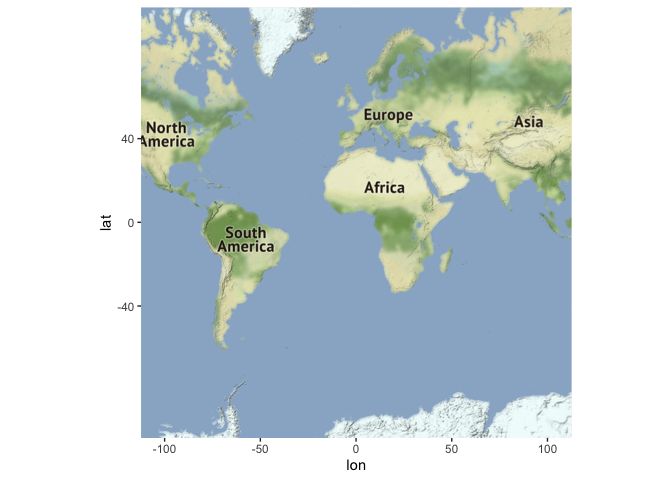
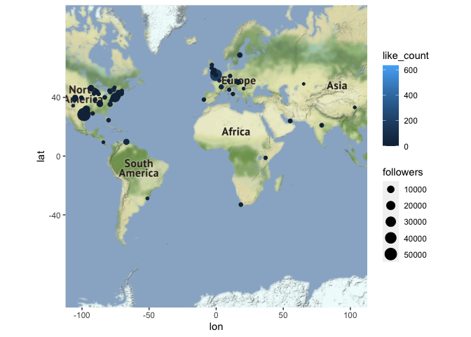
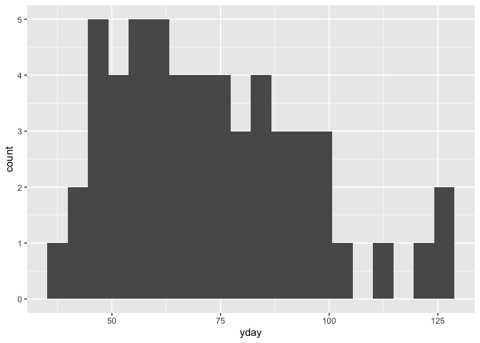

Tidy Tuesday 2021-25 Du bois tweets
================

``` r
library(tidyverse)
```

    ## ── Attaching packages ─────────────────────────────────────── tidyverse 1.3.1 ──

    ## ✓ ggplot2 3.3.3     ✓ purrr   0.3.4
    ## ✓ tibble  3.1.1     ✓ dplyr   1.0.6
    ## ✓ tidyr   1.1.3     ✓ stringr 1.4.0
    ## ✓ readr   1.4.0     ✓ forcats 0.5.1

    ## ── Conflicts ────────────────────────────────────────── tidyverse_conflicts() ──
    ## x dplyr::filter() masks stats::filter()
    ## x dplyr::lag()    masks stats::lag()

``` r
library(ggmap)
```

    ## Google's Terms of Service: https://cloud.google.com/maps-platform/terms/.

    ## Please cite ggmap if you use it! See citation("ggmap") for details.

## Load the data

<!-- ```{r get_the_data_1st_time}
tweets <- readr::read_csv('https://raw.githubusercontent.com/rfordatascience/tidytuesday/master/data/2021/2021-06-15/tweets.csv')
write_csv(tweets, 'data/tweets.csv')
rm(tweets)
```-->

``` r
tweets <- read_csv("data/tweets.csv")
```

    ## 
    ## ── Column specification ────────────────────────────────────────────────────────
    ## cols(
    ##   datetime = col_datetime(format = ""),
    ##   content = col_character(),
    ##   retweet_count = col_double(),
    ##   like_count = col_double(),
    ##   quote_count = col_double(),
    ##   text = col_character(),
    ##   username = col_character(),
    ##   location = col_character(),
    ##   followers = col_double(),
    ##   url = col_character(),
    ##   verified = col_logical(),
    ##   lat = col_double(),
    ##   long = col_double()
    ## )

## Put the data on a map

``` r
map_center <- c(lon = 0, lat = 0)
background_map <- get_map(map_center, source = "stamen", zoom = 2)
```

    ## Source : https://maps.googleapis.com/maps/api/staticmap?center=0,0&zoom=2&size=640x640&scale=2&maptype=terrain&key=xxx-4ldmSOsrTG_rzXXCXUMSQy9hzEew

    ## Source : http://tile.stamen.com/terrain/2/0/0.png

    ## Source : http://tile.stamen.com/terrain/2/1/0.png

    ## Source : http://tile.stamen.com/terrain/2/2/0.png

    ## Source : http://tile.stamen.com/terrain/2/3/0.png

    ## Source : http://tile.stamen.com/terrain/2/0/1.png

    ## Source : http://tile.stamen.com/terrain/2/1/1.png

    ## Source : http://tile.stamen.com/terrain/2/2/1.png

    ## Source : http://tile.stamen.com/terrain/2/3/1.png

    ## Source : http://tile.stamen.com/terrain/2/0/2.png

    ## Source : http://tile.stamen.com/terrain/2/1/2.png

    ## Source : http://tile.stamen.com/terrain/2/2/2.png

    ## Source : http://tile.stamen.com/terrain/2/3/2.png

    ## Source : http://tile.stamen.com/terrain/2/0/3.png

    ## Source : http://tile.stamen.com/terrain/2/1/3.png

    ## Source : http://tile.stamen.com/terrain/2/2/3.png

    ## Source : http://tile.stamen.com/terrain/2/3/3.png

``` r
ggmap(background_map)
```

<!-- -->

``` r
clean_tweets <- tweets %>%
  filter(is.na(lat) != TRUE | is.na(long) != TRUE)

ggmap(background_map) +
    geom_point(data = clean_tweets, aes(long, lat, size = followers, color = like_count))
```

    ## Warning: Removed 30 rows containing missing values (geom_point).

<!-- -->

## How many tweeters?

``` r
tweets %>%
  count(username, sort = TRUE)
```

    ## # A tibble: 167 x 2
    ##    username            n
    ##    <chr>           <int>
    ##  1 AlDatavizguy      125
    ##  2 sqlsekou           32
    ##  3 ajstarks           30
    ##  4 CharlieEatonPhD    15
    ##  5 AsjadNaqvi         11
    ##  6 AdamMico1          10
    ##  7 DocKevinElder      10
    ##  8 manup4             10
    ##  9 lukestanke          8
    ## 10 Jasonforrestftw     7
    ## # … with 157 more rows

``` r
# Some kind of network analysis using usernames and the @ in text


# What kinds of devices are people using?
tweets %>%
  filter(is.na(datetime) != TRUE) %>%
  select(text, username) %>%
  mutate(device = case_when(
    str_detect(text, "iPhone") ~ "Apple",
    str_detect(text, "iPad") ~ "Apple",
    str_detect(text, "apple") ~ "Apple",
    str_detect(text, "TweetDeck") ~ "TweetDeck",
    str_detect(text, "Crowdfire") ~ "Crowdfire",
    str_detect(text, "Buffer") ~ "Buffer",
    str_detect(text, "android") ~ "Android",
    str_detect(text, "Web App") ~ "Website",
    )
  ) %>%
 # group_by(username, device) %>%
  count(device, sort = TRUE)
```

    ## # A tibble: 6 x 2
    ##   device        n
    ##   <chr>     <int>
    ## 1 Website     352
    ## 2 Apple        48
    ## 3 Android      25
    ## 4 TweetDeck    16
    ## 5 Crowdfire     2
    ## 6 Buffer        1

## Tweets over time …

``` r
library(lubridate)
```

    ## 
    ## Attaching package: 'lubridate'

    ## The following objects are masked from 'package:base':
    ## 
    ##     date, intersect, setdiff, union

``` r
tweets %>%
  filter(is.na(datetime) != TRUE) %>%
  select(datetime, username, followers) %>%
  mutate(yday = yday(datetime)) %>%
  group_by(yday) %>%
  summarize(reach = sum(followers)) %>%
  arrange(yday) %>%
  ggplot(aes(x = yday)) +
    geom_histogram(bins = 20)
```

<!-- -->

<div id="refs" class="references csl-bib-body hanging-indent">

<div id="ref-tidytuesday" class="csl-entry">

Mock, Thomas. 2021. “Tidy Tuesday: A Weekly Data Project Aimed at the r
Ecosystem.” <https://github.com/rfordatascience/tidytuesday>.

</div>

<div id="ref-R-base" class="csl-entry">

R Core Team. 2019. *R: A Language and Environment for Statistical
Computing*. Vienna, Austria: R Foundation for Statistical Computing.
<https://www.R-project.org>.

</div>

</div>
