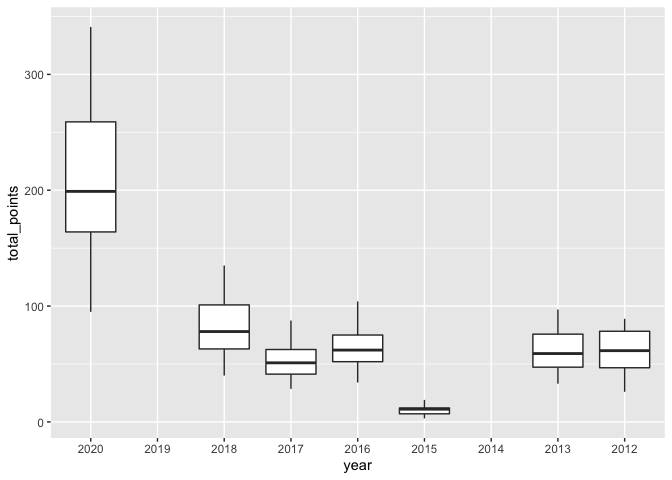
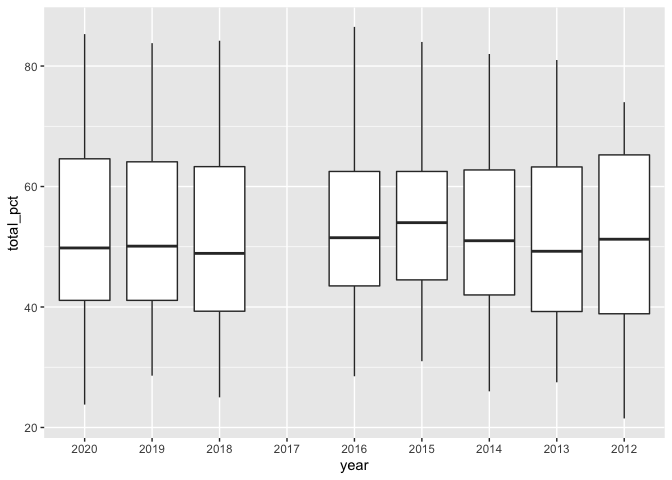
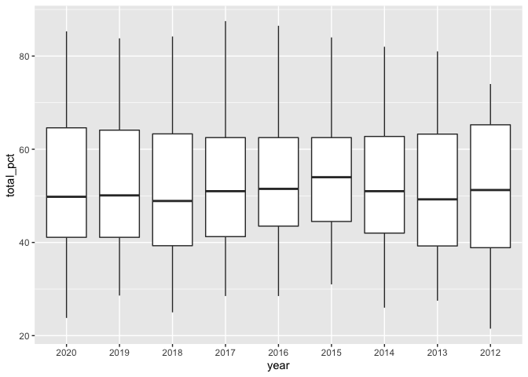
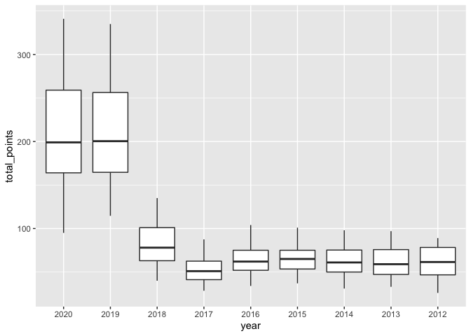

Tidy Tuesday 2021-26 Parks
================

## Setup

``` r
library(tidyverse)
```

## Load the data

``` r
# Data source: https://raw.githubusercontent.com/rfordatascience/tidytuesday/master/data/2021/2021-06-22/parks.csv
parks_raw <- read_csv('data/parks.csv',
                col_types = cols(
                  year = col_factor(levels = NULL), # could cast as type date
                  rank = col_number(),
                  city = col_factor(levels = NULL), # for ease of processing
                  med_park_size_data = col_double(),
                  med_park_size_points = col_double(),
                  park_pct_city_data = col_character(), # trailing % sign
                  park_pct_city_points = col_double(),
                  pct_near_park_data = col_character(), # trailing % sign
                  pct_near_park_points = col_double(),
                  spend_per_resident_data = col_character(), # preceding $ sign
                  spend_per_resident_points = col_double(),
                  basketball_data = col_double(),
                  basketball_points = col_double(),
                  dogpark_data = col_double(),
                  dogpark_points = col_double(),
                  playground_data = col_double(),
                  playground_points = col_double(),
                  rec_sr_data = col_double(),
                  rec_sr_points = col_double(),
                  restroom_data = col_double(),
                  restroom_points = col_double(),
                  splashground_data = col_double(),
                  splashground_points = col_double(),
                  amenities_points = col_double(),
                  total_points = col_double(),
                  total_pct = col_double(),
                  city_dup = col_character(),
                  park_benches = col_double()
                )
              )
```

Question 1: Is it better to cast the year variable as a date, to be able
to do arithmetic with it later?

## Explore and clean the data

### Remove stray characters and cast to appropriate data types

``` r
parks <- parks_raw %>%
  mutate(
    park_pct_city_data = str_remove(park_pct_city_data, "%"), # remove %
    pct_near_park_data = str_remove(pct_near_park_data, "%"), # remove %
    spend_per_resident_data = str_remove(spend_per_resident_data, "\\$"), # remove $
    ) %>%
  mutate(
    park_pct_city_data = as.double(park_pct_city_data),
    pct_near_park_data = as.double(pct_near_park_data),
    spend_per_resident_data = as.double(spend_per_resident_data)
  ) %>%
  select(year:splashground_points, last_col(), everything(), -city_dup) # re-order cleanly
```

Question 2: Is there a better way to do these mutate calls more cleanly?

### Explore spread of values using total\_points (total points per year)

``` r
parks %>%
  select(year, total_points) %>%
  group_by(year) %>%
  ggplot(aes(x = year, y = total_points)) +
    geom_boxplot()
```

    ## Warning: Removed 157 rows containing non-finite values (stat_boxplot).

<!-- --> Seems the
basis for calculating the index moves around significantly from year to
year. Maybe the total percentage data looks better? Quite a few rows not
used …

### Explore spread of values using total\_pct (percentage total per year)

``` r
parks %>%
  select(year, total_pct) %>%
  group_by(year) %>%
  ggplot(aes(x = year, y = total_pct)) +
    geom_boxplot()
```

    ## Warning: Removed 99 rows containing non-finite values (stat_boxplot).

<!-- -->

A bit more consistent, but let’s see if we can fill that gap in 2017 …

### Fill in gap in 2017 total\_pct observations

2017 seems to be missing total percentages. Consulting the published
datasheet
(<https://parkserve.tpl.org/mapping/historic/2017_ParkScoreRank.pdf>)
confirms that in 2017, the total\_points were out of 100, so the
total\_point score is the same number as a percentage score. Let’s fix
that.

``` r
parks <- parks %>%
  mutate(total_pct = case_when(
    (is.na(total_pct) == TRUE & year == "2017") ~ total_points, # points out of 100
    TRUE ~ total_pct)
  )
```

Let’s have another look at that box plot of the total percentages

### Explore spread of values using total\_pct (percentage total per year) - again

``` r
parks %>%
  select(year, total_pct) %>%
  group_by(year) %>%
  ggplot(aes(x = year, y = total_pct)) +
    geom_boxplot()
```

<!-- -->

That’s much better. Let’s go back and see about that total\_points
figure …

### Explore spread of values using total\_points (total points per year) - again

``` r
parks %>%
  select(year, total_points) %>%
  group_by(year) %>%
  ggplot(aes(x = year, y = total_points)) +
    geom_boxplot()
```

    ## Warning: Removed 157 rows containing non-finite values (stat_boxplot).

<!-- -->

### Re-calculate 2015 total\_points observations

2015 seems to have very, very low average total\_points. On closer
inspection, it looks like the average points out of 20 for amentiies
have been erroneously coded as total\_points, rather than as one of
several inputs summed to reach the total. Let’s fix that.

``` r
parks <- parks %>%
  mutate(total_points = case_when(
      year == "2015" ~ med_park_size_points + park_pct_city_points + pct_near_park_points + spend_per_resident_points + total_points, # points out of 120
      TRUE ~ total_points)
  )
```

### Fill in gaps in 2014 and 2019 total\_points observations

And, 2019 and 2014 seem to be missing total\_point observations. Drawing
on the published datasheets for these years, it is possible to calculate
total\_points from the components and weightings. Let’s rebuild these in
the dataset.

``` r
parks <- parks %>%
  mutate(total_points = case_when(
      (is.na(total_points) == TRUE & year == "2014") ~ med_park_size_points + park_pct_city_points + pct_near_park_points + spend_per_resident_points + playground_points, # points out of 120
      (is.na(total_points) == TRUE & year == "2019") ~ med_park_size_points + park_pct_city_points + pct_near_park_points + spend_per_resident_points + amenities_points, # points out of 400
      TRUE ~ total_points)
  )
```

### Explore spread of values using total\_points (total points per year) - again

``` r
parks %>%
  select(year, total_points) %>%
  group_by(year) %>%
  ggplot(aes(x = year, y = total_points)) +
    geom_boxplot()
```

<!-- -->

Much better. Looks like some changes to the methodology in 2018 and
2019.

I wonder What happened to scores in 2017 ..?

Let’s make all this a bit easier to re-produce in future …

### Add in an index\_base variable to help with future calculations

``` r
parks <- parks %>%
  mutate(index_base = case_when(
    year %in% c("2017") ~ 100,
    year %in% c("2012", "2013", "2014", "2015", "2016") ~ 120,
    year %in% c("2018") ~ 160,
    year %in% c("2019", "2020") ~ 400,
    )
  ) %>%
  select(year:total_points, last_col(), everything())
```

# References

<div id="refs" class="references csl-bib-body hanging-indent">

<div id="ref-tidytuesday" class="csl-entry">

Mock, Thomas. 2021. “Tidy Tuesday: A Weekly Data Project Aimed at the r
Ecosystem.” <https://github.com/rfordatascience/tidytuesday>.

</div>

<div id="ref-R-base" class="csl-entry">

R Core Team. 2019. *R: A Language and Environment for Statistical
Computing*. Vienna, Austria: R Foundation for Statistical Computing.
<https://www.R-project.org>.

</div>

</div>
