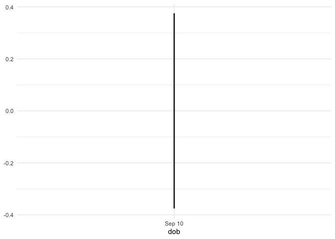
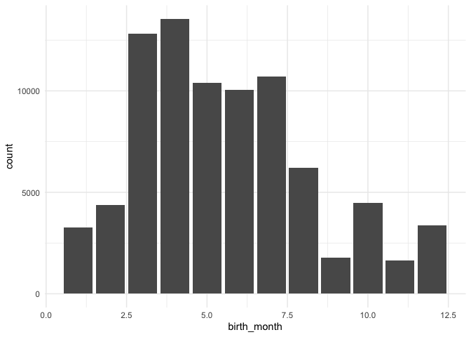
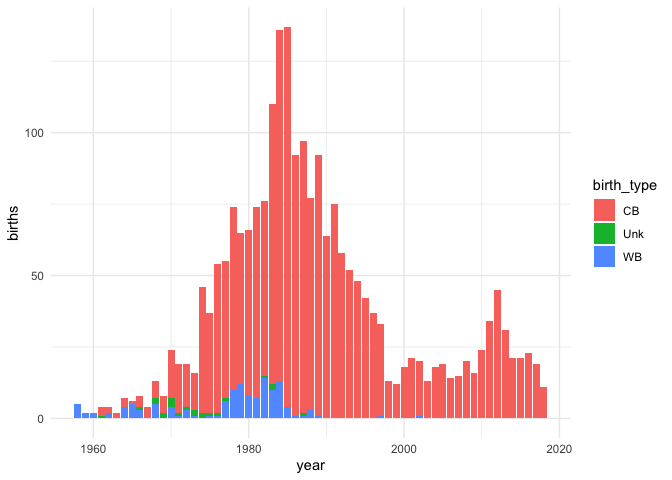
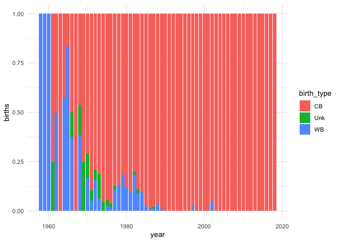

2021-08-24\_lemurs
================
DdH
24/08/2021

``` r
lemurs <- readr::read_csv('https://raw.githubusercontent.com/rfordatascience/tidytuesday/master/data/2021/2021-08-24/lemur_data.csv', show_col_types = FALSE)
taxonomy <- readr::read_csv('https://raw.githubusercontent.com/rfordatascience/tidytuesday/master/data/2021/2021-08-24/taxonomy.csv', show_col_types = FALSE)
```

# Exploratory data analysis

There are 2270 unique lemurs in this dataset, with a total of 82609
observations.

``` r
lemurs %>%
  group_by(dlc_id) %>%
  filter(!is.na(dob) & dlc_id == "0270") %>%
  ggplot(aes(x = dob)) +
    geom_boxplot()
```

<!-- -->

``` r
lemurs %>%
  group_by(dlc_id) %>%
  filter(!is.na(dob)) %>%
  ggplot(aes(x = birth_month)) +
    geom_bar()
```

<!-- -->
\#\# How many births of each type each year over time?

``` r
lemurs %>%
  mutate(year = lubridate::year(dob)) %>%
  filter(year != 1946 & !is.na(year) == TRUE) %>%
  group_by(dlc_id, birth_type, year) %>%
  summarise(total_lemurs = n_distinct(dlc_id)) %>%
  group_by(birth_type, year) %>%
  summarize(births = n()) %>%
  arrange(births) %>%
  ggplot(aes(x = year, y = births, fill = birth_type)) +
    geom_col()
```

    ## `summarise()` has grouped output by 'dlc_id', 'birth_type'. You can override using the `.groups` argument.

    ## `summarise()` has grouped output by 'birth_type'. You can override using the `.groups` argument.

<!-- -->
\#\# Percentage of birth types over time?

``` r
lemurs %>%
  mutate(year = lubridate::year(dob)) %>%
  filter(year != 1946 & !is.na(year) == TRUE) %>%
  group_by(dlc_id, birth_type, year) %>%
  summarise(total_lemurs = n_distinct(dlc_id)) %>%
  group_by(birth_type, year) %>%
  summarize(births = n()) %>%
  arrange(births) %>%
  ggplot(aes(x = year, y = births, fill = birth_type)) +
    geom_col(position = "fill")
```

    ## `summarise()` has grouped output by 'dlc_id', 'birth_type'. You can override using the `.groups` argument.

    ## `summarise()` has grouped output by 'birth_type'. You can override using the `.groups` argument.

<!-- -->

``` r
lemurs %>%
  mutate(year = lubridate::year(dob)) %>%
  filter(year != 1946 & !is.na(year) == TRUE) %>%
  group_by(year) %>%
  summarise(births_by_year = n()) %>%
  arrange(year)
```

    ## # A tibble: 61 × 2
    ##     year births_by_year
    ##    <dbl>          <int>
    ##  1  1958             14
    ##  2  1959             53
    ##  3  1960             31
    ##  4  1961              7
    ##  5  1962              5
    ##  6  1963              5
    ##  7  1964             12
    ##  8  1965             79
    ##  9  1966            114
    ## 10  1967              8
    ## # … with 51 more rows

# References

<div id="refs" class="references csl-bib-body hanging-indent">

<div id="ref-tidytuesday" class="csl-entry">

Mock, Thomas. 2021. “Tidy Tuesday: A Weekly Data Project Aimed at the r
Ecosystem.” <https://github.com/rfordatascience/tidytuesday>.

</div>

<div id="ref-R-base" class="csl-entry">

R Core Team. 2019. *R: A Language and Environment for Statistical
Computing*. Vienna, Austria: R Foundation for Statistical Computing.
<https://www.R-project.org>.

</div>

</div>
