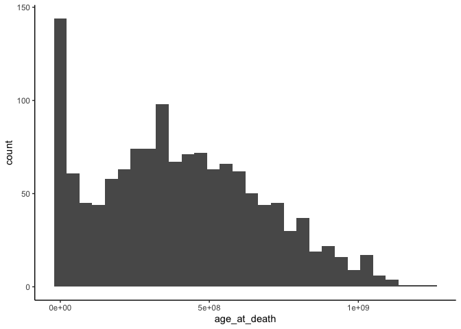
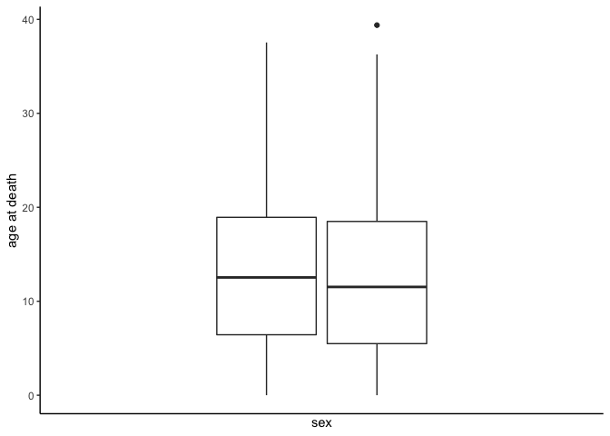
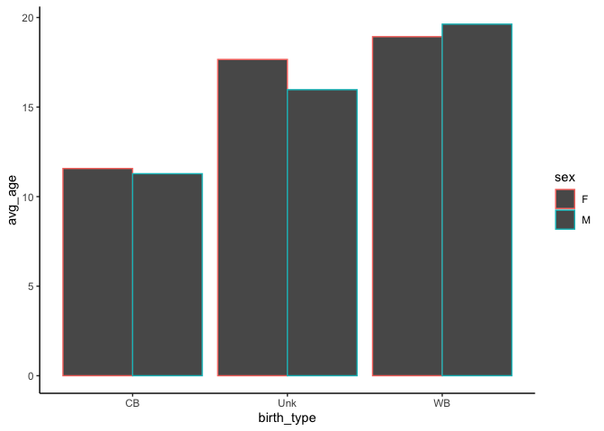
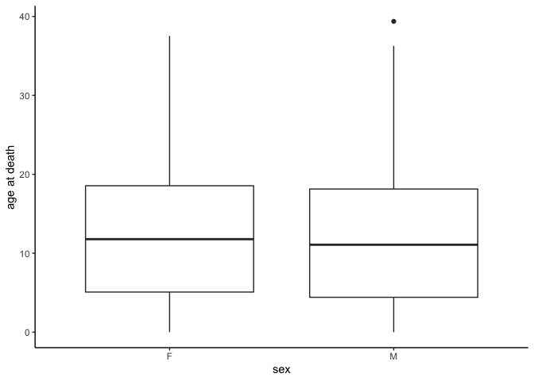
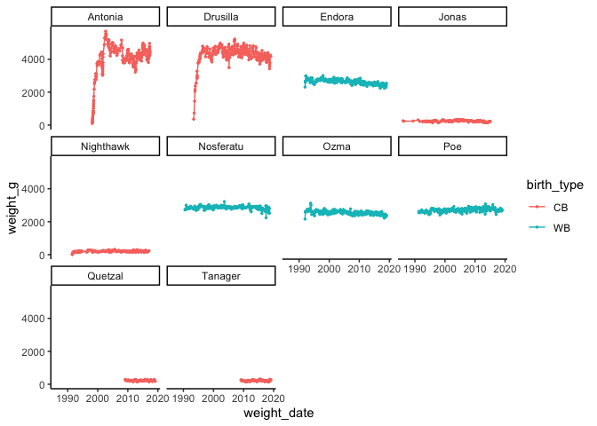
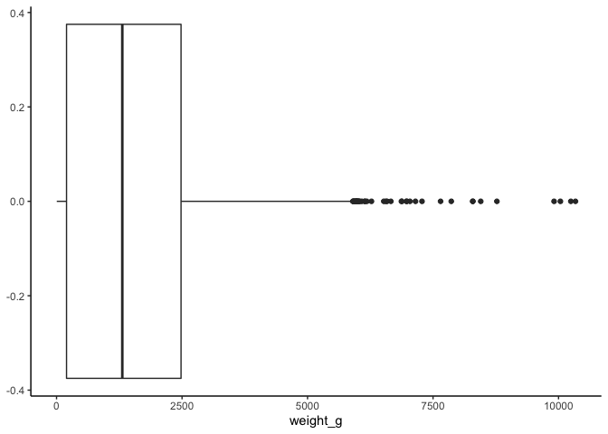
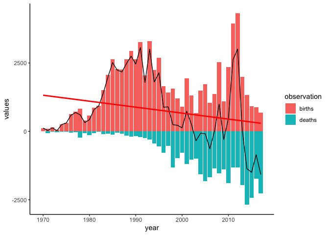

2021-08-24\_lemurs
================
DdH
24/08/2021

``` r
lemurs <- readr::read_csv('https://raw.githubusercontent.com/rfordatascience/tidytuesday/master/data/2021/2021-08-24/lemur_data.csv', show_col_types = FALSE)
taxonomy <- readr::read_csv('https://raw.githubusercontent.com/rfordatascience/tidytuesday/master/data/2021/2021-08-24/taxonomy.csv', show_col_types = FALSE)
```

# Exploratory data analysis

There are 2270 unique lemurs in this dataset, with a total of 82609
observations.

``` r
lemurs %>%
  group_by(dlc_id) %>%
  filter(!is.na(dob)) %>%
  ggplot(aes(x = dob)) +
    geom_boxplot()
```

<!-- -->

``` r
lemurs %>%
  group_by(dlc_id) %>%
  filter(!is.na(dob)) %>%
  ggplot(aes(x = birth_month)) +
    geom_bar()
```

<!-- -->
\#\# How many births of each type each year over time?

``` r
lemurs %>%
  mutate(year = lubridate::year(dob)) %>%
  filter(year != 1946 & !is.na(year) == TRUE) %>%
  group_by(dlc_id, birth_type, year) %>%
  summarise(total_lemurs = n_distinct(dlc_id)) %>%
  group_by(birth_type, year) %>%
  summarize(births = n()) %>%
  arrange(births) %>%
  ggplot(aes(x = year, y = births, fill = birth_type)) +
    geom_col()
```

    ## `summarise()` has grouped output by 'dlc_id', 'birth_type'. You can override using the `.groups` argument.

    ## `summarise()` has grouped output by 'birth_type'. You can override using the `.groups` argument.

<!-- -->
\#\# Percentage of birth types over time?

``` r
lemurs %>%
  mutate(year = lubridate::year(dob)) %>%
  filter(year != 1946 & !is.na(year) == TRUE) %>%
  group_by(dlc_id, birth_type, year) %>%
  summarise(total_lemurs = n_distinct(dlc_id)) %>%
  group_by(birth_type, year) %>%
  summarize(births = n()) %>%
  arrange(births) %>%
  ggplot(aes(x = year, y = births, fill = birth_type)) +
    geom_col(position = "fill")
```

    ## `summarise()` has grouped output by 'dlc_id', 'birth_type'. You can override using the `.groups` argument.

    ## `summarise()` has grouped output by 'birth_type'. You can override using the `.groups` argument.

<!-- -->

``` r
lemurs %>%
  mutate(year = lubridate::year(dob)) %>%
  filter(year != 1946 & !is.na(year) == TRUE) %>%
  group_by(year) %>%
  summarise(births_by_year = n()) %>%
  arrange(year)
```

    ## # A tibble: 61 × 2
    ##     year births_by_year
    ##    <dbl>          <int>
    ##  1  1958             14
    ##  2  1959             53
    ##  3  1960             31
    ##  4  1961              7
    ##  5  1962              5
    ##  6  1963              5
    ##  7  1964             12
    ##  8  1965             79
    ##  9  1966            114
    ## 10  1967              8
    ## # … with 51 more rows

## What is the average life expectancy of a lemur ?

``` r
ages_at_death <- lemurs %>%
  filter(!is.na(dob) == TRUE & dob > '1950-01-01' & !is.na(dod) == TRUE & sex %in% c("M", "F")) %>%
  mutate(age_at_death = as.duration(dod - dob)) %>%
  select(dlc_id, name, dob, dod, age_at_death, sex, birth_institution) %>%
  group_by(dlc_id, age_at_death, sex, birth_institution) %>%
  summarise(total_lemurs = n_distinct(dlc_id)) %>%
  filter(age_at_death != 0)
```

    ## `summarise()` has grouped output by 'dlc_id', 'age_at_death', 'sex'. You can override using the `.groups` argument.

``` r
ages_at_death
```

    ## # A tibble: 1,364 × 5
    ## # Groups:   dlc_id, age_at_death, sex [1,364]
    ##    dlc_id age_at_death              sex   birth_institution total_lemurs
    ##    <chr>  <Duration>                <chr> <chr>                    <int>
    ##  1 0005   487728000s (~15.46 years) M     Duke Lemur Center            1
    ##  2 0006   428544000s (~13.58 years) F     Duke Lemur Center            1
    ##  3 0009   327369600s (~10.37 years) M     Duke Lemur Center            1
    ##  4 0010   424569600s (~13.45 years) M     Duke Lemur Center            1
    ##  5 0026   52531200s (~1.66 years)   M     Duke Lemur Center            1
    ##  6 0028   21600000s (~35.71 weeks)  F     Duke Lemur Center            1
    ##  7 0201   357696000s (~11.33 years) F     Unknown Location             1
    ##  8 0259   313632000s (~9.94 years)  M     Unknown Location             1
    ##  9 0270   25488000s (~42.14 weeks)  F     Duke Lemur Center            1
    ## 10 0277   114134400s (~3.62 years)  M     Duke Lemur Center            1
    ## # … with 1,354 more rows

``` r
ages_at_death %>%
  ggplot(aes(x = age_at_death)) +
    geom_histogram()
```

    ## `stat_bin()` using `bins = 30`. Pick better value with `binwidth`.

<!-- -->

``` r
ages_at_death %>%
  ggplot(aes(x = age_at_death/31536000, group = sex)) +
    geom_boxplot() +
    scale_x_continuous() +
    scale_y_discrete(breaks = c("male", "female")) +
    labs(y = "sex", x = "age at death") +
    coord_flip()
```

<!-- -->

``` r
output <- ages_at_death %>%
  group_by(total_lemurs) %>%
  summarise(avg_life_expectancy = as.duration(mean(age_at_death))) %>%
  select(avg_life_expectancy)

as.duration(output$avg_life_expectancy)
```

    ## [1] "401059171.847507s (~12.71 years)"

``` r
clean_lemurs <- lemurs %>%
  filter(!is.na(dob) == TRUE & dob > '1950-01-01' & !is.na(dod) == TRUE & sex %in% c("M", "F")) %>%
  distinct(dlc_id, name, .keep_all = TRUE) %>%
  mutate(age_at_death = as.duration(dod - dob), sex = as.factor(sex), birth_institution = as.factor(birth_institution), birth_type = as.factor(birth_type)) %>%
  select(dlc_id, name, dob, dod, age_at_death, sex, birth_type, birth_institution)
```

``` r
clean_lemurs %>%
  select(name, sex, age_at_death, birth_type) %>%
  group_by(birth_type, sex) %>%
  summarize(avg_age = round(mean(age_at_death/31536000), 2)) %>%
  ggplot(aes(x = birth_type, y = avg_age, color = sex)) +
    geom_col(position = "dodge")
```

    ## `summarise()` has grouped output by 'birth_type'. You can override using the `.groups` argument.

<!-- -->

``` r
clean_lemurs %>%
  select(name, sex, age_at_death) %>%
  ggplot(aes(x = sex, y = age_at_death/31536000)) +
    geom_boxplot() +
    scale_y_continuous() +
    labs(x = "sex", y = "age at death")
```

<!-- -->

``` r
clean_lemurs %>%
  select(name, sex, age_at_death)
```

    ## # A tibble: 1,434 × 3
    ##    name      sex   age_at_death             
    ##    <chr>     <fct> <Duration>               
    ##  1 KANGA     M     487728000s (~15.46 years)
    ##  2 ROO       F     428544000s (~13.58 years)
    ##  3 POOH BEAR M     327369600s (~10.37 years)
    ##  4 EEYORE    M     424569600s (~13.45 years)
    ##  5 BARNABY   M     52531200s (~1.66 years)  
    ##  6 TOOTSIE   F     21600000s (~35.71 weeks) 
    ##  7 MRS. NOAH F     357696000s (~11.33 years)
    ##  8 LEADBELLY M     313632000s (~9.94 years) 
    ##  9 LILLO     F     25488000s (~42.14 weeks) 
    ## 10 CARLOS    M     114134400s (~3.62 years) 
    ## # … with 1,424 more rows

``` r
top10_lemurs <- lemurs %>%
  group_by(dlc_id) %>%
  summarize(total_obs = n()) %>%
  arrange(desc(total_obs)) %>%
  slice_head(n = 10) %>%
  pull(dlc_id)

lemurs %>%
  filter(dlc_id %in% top10_lemurs) %>%
  group_by(dlc_id) %>%
  select(name, weight_date, weight_g, age_at_wt_y, sex, birth_type) %>%
  ggplot(aes(x = weight_date, y = weight_g, color = birth_type)) +
    geom_point(size = 0.5) +
    geom_line() +
    facet_wrap(~name)
```

    ## Adding missing grouping variables: `dlc_id`

<!-- -->

``` r
lemurs %>%
  ggplot(aes(x = weight_g)) +
    geom_boxplot()
```

<!-- -->

``` r
lemurs %>%
  arrange(desc(weight_g)) %>% 
  slice_head(n = 1000) %>%
  distinct(dlc_id, name, .keep_all = TRUE) %>%
  select(name, weight_date, weight_g, taxon) %>%
  inner_join(taxonomy, by = c("taxon"))
```

    ## # A tibble: 74 × 6
    ##    name            weight_date weight_g taxon latin_name       common_name      
    ##    <chr>           <date>         <dbl> <chr> <chr>            <chr>            
    ##  1 SABINA          1991-09-30     10337 PCOQ  Propithecus coq… Coquerel's sifaka
    ##  2 Pompeia Plotina 2019-01-29      6180 PCOQ  Propithecus coq… Coquerel's sifaka
    ##  3 Kizzy           2008-09-25      6145 VVV   Varecia variega… Black-and-white …
    ##  4 MARCELLA        1991-07-11      6136 PCOQ  Propithecus coq… Coquerel's sifaka
    ##  5 Rodelinda       2019-01-19      6080 PCOQ  Propithecus coq… Coquerel's sifaka
    ##  6 OCTAVIA         1988-06-17      5902 PCOQ  Propithecus coq… Coquerel's sifaka
    ##  7 CASTOR          1996-09-15      5700 VRUB  Varecia rubra    Red ruffed lemur 
    ##  8 Antonia         2002-08-22      5700 PCOQ  Propithecus coq… Coquerel's sifaka
    ##  9 MOON            1993-04-07      5620 VVV   Varecia variega… Black-and-white …
    ## 10 CLOTHO          1985-04-12      5584 VVV   Varecia variega… Black-and-white …
    ## # … with 64 more rows

``` r
# Plot of the number of births and deaths in each year, with trend line.
births_by_year <- lemurs %>%
  filter(!is.na(dob) & birth_type == "CB") %>%
  select(dob) %>%
  mutate(dob_year = year(dob)) %>%
  group_by(dob_year) %>%
  count(name = "births")
  
deaths_by_year <- lemurs %>%
  filter(!is.na(dod) & birth_type == "CB") %>%
  select(dod) %>%
  mutate(dod_year = year(dod)) %>%
  group_by(dod_year) %>%
  count(name = "deaths")

net_change <- births_by_year %>% 
  full_join(deaths_by_year, by = c("dob_year" = "dod_year")) %>%
  filter(births + deaths > 50) %>% 
  rename(year = dob_year) %>%
  filter(year < 2018) %>% 
  mutate(deaths = deaths * -1, net_change = (births + deaths))

trans_dat <- net_change %>% 
  pivot_longer(births:deaths, names_to = "observation", values_to = "values") %>% 
  select(-net_change)

p1 <- ggplot(data = trans_dat, aes(x = year, y = values, fill = observation)) +
        geom_col()

p1 + 
  geom_line(data = net_change, aes(x = year, y = net_change), color = "black", inherit.aes = FALSE) +
  geom_smooth(data = net_change, method = lm, se = FALSE, aes(x = year, y = net_change), color = "red", inherit.aes = FALSE)
```

    ## `geom_smooth()` using formula 'y ~ x'

<!-- -->

# References

<div id="refs" class="references csl-bib-body hanging-indent">

<div id="ref-tidytuesday" class="csl-entry">

Mock, Thomas. 2021. “Tidy Tuesday: A Weekly Data Project Aimed at the r
Ecosystem.” <https://github.com/rfordatascience/tidytuesday>.

</div>

<div id="ref-R-base" class="csl-entry">

R Core Team. 2019. *R: A Language and Environment for Statistical
Computing*. Vienna, Austria: R Foundation for Statistical Computing.
<https://www.R-project.org>.

</div>

</div>
