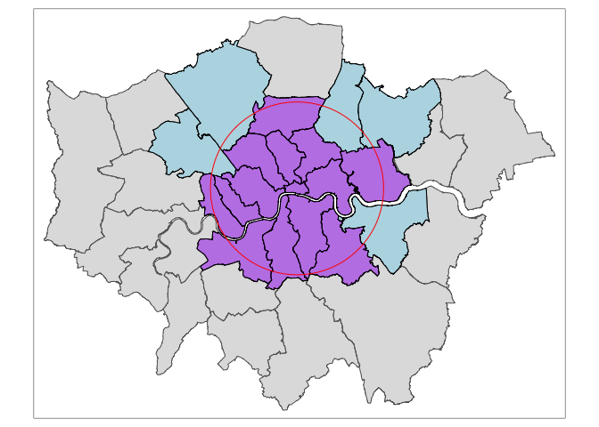

Testing mapping in R
================

    ## Linking to GEOS 3.8.1, GDAL 3.2.1, PROJ 7.2.1

    ## ── Attaching packages ─────────────────────────────────────── tidyverse 1.3.1 ──

    ## ✓ ggplot2 3.3.5     ✓ purrr   0.3.4
    ## ✓ tibble  3.1.5     ✓ dplyr   1.0.7
    ## ✓ tidyr   1.1.4     ✓ stringr 1.4.0
    ## ✓ readr   2.0.2     ✓ forcats 0.5.1

    ## ── Conflicts ────────────────────────────────────────── tidyverse_conflicts() ──
    ## x dplyr::filter() masks stats::filter()
    ## x dplyr::lag()    masks stats::lag()

    ## Registered S3 methods overwritten by 'stars':
    ##   method             from
    ##   st_bbox.SpatRaster sf  
    ##   st_crs.SpatRaster  sf

``` r
# project the london coordinates
lnd_proj <- lnd %>% 
  st_transform(crs = st_crs(27700))

# create a greater london centroid, then create a 10 km buffer
lnd_buffer <- lnd_proj %>% 
  filter(NAME == "City of London") %>% 
  st_centroid() %>% 
  st_buffer(dist = 9900)
```

    ## Warning in st_centroid.sf(.): st_centroid assumes attributes are constant over
    ## geometries of x

``` r
# match the boroughs within the 10km buffer
lnd_boroughs_int <- lnd_proj %>% 
  st_intersects(., lnd_buffer, sparse = FALSE)[c('NAME', 'ONS_INNER'),]

# choose the inner london boroughs # can probable be done with grouping in tmap_*
inner_boroughs <- lnd_boroughs_int %>% 
  filter(ONS_INNER == "T")

outer_boroughs <- lnd_boroughs_int %>% 
  filter(ONS_INNER == "F")

# map all of greater london as a base
tm_shape(lnd_proj) +
  tm_borders() +
  tm_fill(col = "grey", alpha = 0.5) +
# add the boroughs inside the region, with a colour
  tm_shape(outer_boroughs) +
    tm_fill(col = "lightblue", alpha = 0.8) +
    tm_borders(col = "black") +
  tm_shape(inner_boroughs) +
    tm_fill(col = "purple", alpha = 0.5) +
    tm_borders(col = "black") +
# add the buffer as a ring
  tm_shape(lnd_buffer) +
    tm_borders(col = "red") +
    tm_fill(alpha = 0)
```

<!-- -->
