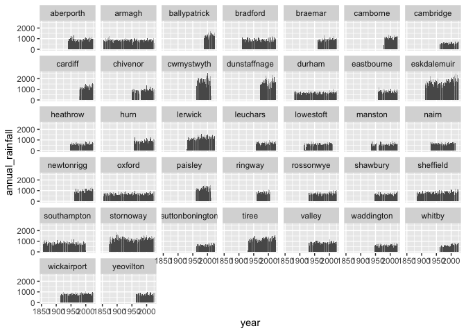
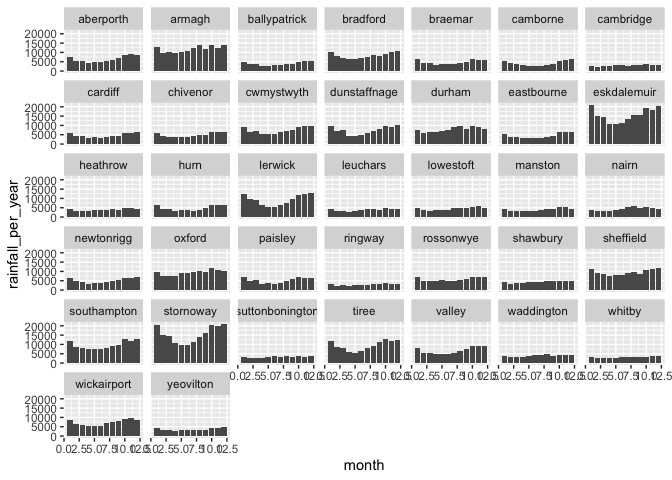
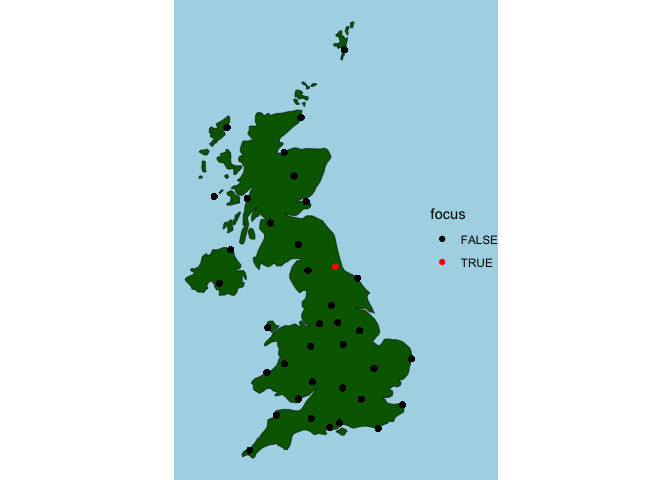

# Tidy Tuesday - (2025, Week 42)
David de Hoog
2025-10-21

## Setup and Data

``` r
library(tidytuesdayR)
library(tidyverse)
library(sf)
library(rnaturalearth)
```

``` r
tidytuesdayR::tt_load('2025-10-21') -> tuesdata

tuesdata$historic_station_met -> historic_station_met
tuesdata$station_meta -> station_meta
```

## Cleaning

No cleaning required.

## EDA

### Oldest weather station ?

``` r
station_meta |>
  select(station, opened) |>
  arrange(opened) |>
  top_n(-1)
```

    Selecting by opened

    # A tibble: 2 × 2
      station opened
      <chr>    <dbl>
    1 armagh    1853
    2 oxford    1853

### When and where does it rain the most?

#### Most annual rainfall

``` r
historic_station_met |>
  summarize(annual_rainfall = sum(rain, na.rm = TRUE), .by = c(station, year)) |>
  ggplot(aes(x = year, y = annual_rainfall)) +
    geom_col() +
    facet_wrap(~ station)
```



#### Rainfall across the year

``` r
historic_station_met |>
  summarize(rainfall_per_year = sum(rain, na.rm = TRUE), .by = c(station, month)) |>
  ggplot(aes(x = month, y = rainfall_per_year)) +
    geom_col() +
    facet_wrap(~ station)
```



## Question: When is the best time of year (sunny and not wet) to visit Durham?

``` r
historic_station_met |>
  filter(station == "durham") |>
  summarize(
    .by = month,
    rainfall = mean(rain, na.rm = TRUE),
    sunshine = mean(sun, na.rm = TRUE),
    tmax = mean(tmax, na.rm = TRUE),
    tmin = mean(tmin, na.rm = TRUE),
  ) -> durham_avg
```

``` r
durham_avg |>
  knitr::kable()
```

| month | rainfall |  sunshine |      tmax |       tmin |
|------:|---------:|----------:|----------:|-----------:|
|     1 | 52.89103 |  50.72182 |  5.968276 |  0.4317241 |
|     2 | 42.43172 |  67.72000 |  6.622759 |  0.5365517 |
|     3 | 44.16345 | 106.13727 |  8.774483 |  1.4696552 |
|     4 | 43.81241 | 137.43000 | 11.424828 |  3.0337931 |
|     5 | 49.87241 | 166.98273 | 14.610345 |  5.5786207 |
|     6 | 50.68414 | 172.48545 | 17.777931 |  8.4910345 |
|     7 | 62.97034 | 160.86818 | 19.689655 | 10.5931034 |
|     8 | 66.58759 | 151.56273 | 19.231724 | 10.4310345 |
|     9 | 54.69793 | 124.52364 | 16.832414 |  8.5151724 |
|    10 | 65.97310 |  93.83211 | 12.892414 |  5.7675862 |
|    11 | 64.26828 |  60.40000 |  8.893103 |  2.9420690 |
|    12 | 57.33379 |  43.54954 |  6.579167 |  1.1416667 |

Looks like June is the sweet spot for a visit to Durham. With 5.7 hours
of sunlight per day, on average. Warmer average temperatures (from 8.5C
to 17.8C) but with lower rainfall (51mm) on average, than other, warmer
months.

``` r
uk <- ne_countries(returnclass = "sf", country = "united kingdom", scale = "medium") |>
  select(admin)
```

``` r
# Join the metadata with location information to the primary data
historic_station_met |>
  inner_join(station_meta, by = "station") |> 
  select(station, station_name, opened, lon = lng, lat, everything()) |>
  st_as_sf(coords = c("lon", "lat"), crs = 4326) -> weather_stations

# Identify the point of interest (Durham) in the data
weather_stations |>
  mutate(focus = case_when(
    station == "durham" ~ TRUE,
    .default = FALSE)
  ) -> weather_stations_plot
```

``` r
# Plot the UK outline and weather stations  
ggplot() +
  geom_sf(data = uk, fill = "dark green", color="black") +
  geom_sf(data = weather_stations_plot, aes(color = focus)) +
  scale_color_manual(values = c("TRUE" = "red", "FALSE" = "black")) +
  theme_void() +
  theme(plot.background = element_rect(fill = "light blue"))
```



``` r
rm(tuesdata)
rm(historic_station_met)
rm(station_meta)
```

## References
